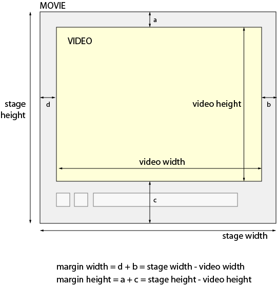
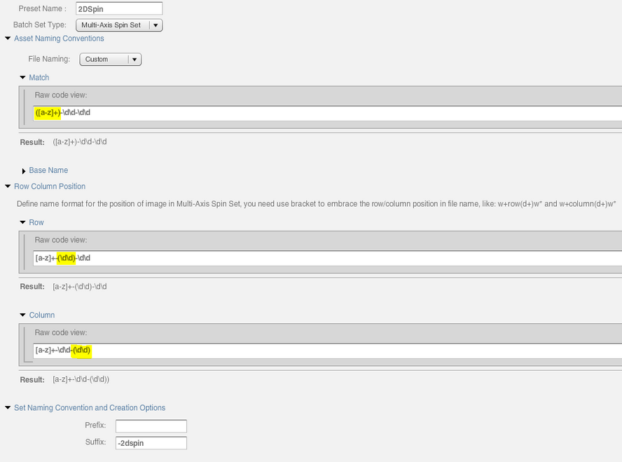

# Application Setup{#application-setup}

You can use the Application Setup pages to enter general settings, create image presets, video encoding presets, viewer presets, or to define default viewers, and metadata. You can also setup batch set presets to automate the generation of 2D spin sets (for example), publishing settings, and video SEO settings.

>[!NOTE]
>
>Only Scene7 Publishing System administrators can change settings on the Application Setup pages.

## General Settings {#general-settings}

To open the Application General Settings page, on the Global Navigation bar, click **Setup** &gt; **Application Setup** &gt; **General Settings**.

**Servers**

On account creation, Scene7 automatically provides the assigned servers for your company. These servers are used to construct URL strings for your web site and applications. These URL calls are specific to your account.

See also [Testing the Secure Testing service](testing-assets-making-them-public.md#testing_the_secure_testing_service).

**Published&#xA;Server Name** This server is the live CDN server used in all system-generated URL calls specific to your account. Do not change this server name unless you are instructed to do so by a Scene7 support technician.

**Origin Server Name** This server is used for quality assurance testing only. Do not change this server name unless instructed to do so by a Scene7 support technician.

**AGM Server Name** This server is used for Web-to-Print templates. This server is set on a company-wide basis. Do not change this server name unless instructed to do so by a Scene7 support technician.

**Test&amp;Target Server Name** Your Test&Target URL, up to and including .com. For instructions about obtaining this URL, see Integrating Scene7 with Target Classic.

**iOS Streaming Server Name** The URL to your Scene7 iOS streaming server. This server delivers streaming video to iOS-based devices using HTTP protocol.

**Progressive Video Server Name** The URL to your Scene7 progressive video server. This server delivers progressive video using HTTP protocol.

**Show URL for unpublished assets** Select this option if you want Scene7 to display a URL when previewing any asset, whether it is published or not. If the asset is not published, the URL does not work. However, you can use the URL for planning or organizational purposes.

**Allow AIR install** Select this option to allow users to download Scene7 Publishing System desktop version to their local hard drives. Users install the application from the Desktop Version area of the Personal Setup screen.

AIR users must manually uninstall their existing app and reinstall from the web version of Scene7 Publishing System (in Personal Settings). After this one-time reinstallation, you are prompted to upgrade whenever the server has a newer version of Scene7 Publishing System AIR. Scene7 Publishing System is integrated with the Application Update Framework which streamlines the upgrade process.

**CDN Invalidation Template** Specifies the template that is used for invalidating the CDN (Content Delivery Network) cache.

For example, suppose you enter an image URL (including image presets or modifiers) referencing `<ID>`, instead of a specific image ID as in the following example:

`http://sample.scene7.com/is/image/Company/<ID>?$s7product$  
`

If the Template just contains `<ID>`, then SPS fills in the `http://<server>/is/image`, where `<server>` is the Publish Server Name that is defined in General Settings.

Setting the CDN Invalidate Template, selecting an image named Backpack_B, and then clicking **File** > **Invalidate CDN** results in the following generated URL in the CDN Invalidate interface:

`http://sample.scene7.com/is/image/Company/Backpack_B?$s7product$  
`

In the URL list box, click **Continue** to clear the cache for that specific image URL call. Note that you can also add URLs by typing or pasting them into the URL list box; you do not need to set the Template beforehand.

After you have selected your CDN Invalidation Template, and made an Invalidate CDN request, an indicator will pop up in the user interface that gives you an estimate of how long it will take to clear the cache.

Similarly, if multiple images are selected within SPS when you click **File** > **Invalidate CDN**, each image is referenced in the saved Template URL. Therefore, you can define a CDN Invalidate Template referencing each URL that is referenced on your Web site (such as product detail, search results, and so forth). Then, when you select one or images for invalidation from cache, the URLs automatically populate the interface.

See [Content caching](scene7-platform-overview.md#content_caching).

See [Republished assets and CDN delays](publishing-files.md#republished_assets_and_cdn_delays).

**Browse**

**Show Projects** Determines whether Projects are available as a means of organizing your Scene7 assets. See Organizing your work with Projects.

**Show Sample eVideo Content** Turn on or off the display of eVideo sample content.

**Show Generated Content** In folders, shows content generated from an asset. For example, when a PDF file is rasterized as it is uploaded, Scene7 creates one image for each page in the original PDF. If Show Generated Content is selected, each image generated when the original PDF was uploaded appears along with the PDF in the folder to which the PDF was uploaded.

**Show Encoded Videos** Deselected (off) by default.

To quickly search and browse for videos in Scene7 Publishing System without having to navigate through numerous encoded derivatives of the same video, leave this option deselected (default). Only the Master Video thumbnail, which is the source video you uploaded and used to create all the derivatives, and only the “parent” Adaptive Video Set thumbnail, which contains all the “child” derivatives of the encoded video set, are displayed in the user interface.

You can, however, still access individual encoded videos from the Master Video or the Adaptive Video Set. To do so, double-click the video thumbnail image to open Detail View. Then click **Encoded Videos** in the right panel to access all the “child” videos.

You can also use **File > Reprocess** to create more encoded “child” videos directly from an Adaptive Video Set. Scene7 Publishing System automatically finds the “parent” Master Video of the Adaptive Video Set and uses that as the source video for transcoding. When you save the new individual encoded videos, however, they are not seen when you search or browse. However, they are still accessible from the Encoded Videos tab in Detail View.

See [Uploading and transcoding video](uploading-encoding-videos.md#uploading_and_encoding_videos).

To continue the ability to access all your encoded video derivatives when you search and browse, select **Show Encoded Videos**.

There are certain actions on the Build menu that only work, or optionally work, with individual videos. This functionality makes it necessary to show all the encoded video derivatives that you can select from, regardless of how you set **Show Encoded Videos**. The Build actions that over-ride the **Show Encoded Videos** setting include **Adaptive Video Sets**, and **eCatalogs**.

***Note**: If you did not use Scene7 Publishing System to upload and encode your video assets, Scene7 shows all your individual encoded videos, even is this option is deselected.*

**Show Refresh Subfolders Button** Turn on or off the display of the subfolders Refresh button.

**Scene7 FTP Account**

**Server** Lists your FTP account server.

**User Name** Lists your FTP account user name.

**Upload to Application**

**Overwrite Images** Scene7 does not allow two files to have the same name. Each item's Scene7 Publishing System ID (the image name minus the filename extension) must be unique. Because of this rule, the Upload dialog box has an Overwrite option. The exact effect of this option depends on the specified Overwrite Images option. These options specify how replacement images are uploaded: whether they replace the original images, or become duplicate images. Duplicate images are renamed with a “-1” (for example, chair.tif is renamed chair-1.tif). These options affect images uploaded to a different folder than the original or images with a different filename extension from the original (such as JPG, TIF, or PNG). (See Using the Overwrite Images option.)

**Overwrite in current folder, same base image name/extension  
**

This option is the strictest rule for replacement. It requires that you upload the replacement image to the same folder as the original, and that the replacement image has the same filename extension as the original. If these requirements are not met, a duplicate is created.

**Overwrite in current folder, same base asset name regardless of extension  
**

Requires that you upload the replacement image to the same folder as the original, however the filename extension can be different from the original. For example, chair.tif replaces chair.jpg.

**Overwrite in any folder, same base asset name/extension  
**

Requires that the replacement image has the same filename extension as the original image (for example, chair.jpg must replace chair.jpg, not chair.tif). However, you can upload the replacement image to a different folder than the original. The updated image resides in the new folder; the file can no longer be found in its original location

**Overwrite in any folder, same base asset name regardless of extension  
**

This option is the most inclusive replacement rule. You can upload a replacement image to a different folder than the original, upload a file with a different filename extension, and replace the original file. If the original file is in a different folder, the replacement image resides in the new folder to which it was uploaded.

**Retain Publish** Specifies whether a replacement image uploaded to Scene7 retains the Ready to Publish setting of the image it is replacing, or the setting is specified on upload.

**Default Color Profiles** Specifies the color profiles applied as part of Default Color Profile Options when adding CMYK images.

**Default Upload Options** Opens the Upload Job Options dialog box, where you can specify default upload options. For information about these options, see Upload options.

**Image Map Editor, to Application**

**Default Image Mapping HREF** Defines the default URL used for the image mapping href column. This URL is the default URL you see when you create new Image Maps.

**Default Image Mapping Template** Defines the default Javascript for the image mapping href template. You can set custom code here to be executed whenever you click an image map.

**Other Settings, to Application**

**Trash Can Clean Up Warnings** Assets in the Trash are automatically removed within seven days. Select “Send emails before trash items are automatically deleted” if you want notifications sent to company administrators when assets that are in the Trash are four days away from being permanently deleted. See Managing the Trash folder.

## Using the Overwrite Images option {#using-the-overwrite-images-option}

Scene7 does not allow two files to have the same name. Each item's Scene7 Publishing System ID (the image name minus the filename extension) must be unique. Because of this rule, the Upload dialog box includes Overwrite Images options. The exact effect of this option depends on a setting for each company's Scene7 Publishing System Internal Settings.

If you previously uploaded images and then changed the original files (or replaced them), the chosen Overwrite option specifies how Scene7 replaces the images. No information about the image changes, but the new image replaces the old one. If the folder also contains images that are not already in Scene7, these images are added.

Use this option if images you have uploaded have changed in some way (image has been altered) but the reference to the image remains the same. Overwrite is also helpful when uploading and ripping Adobe® PDFs. To fine-tune how Scene7 *rips* the image, adjust the ICC color profile options in the Upload dialog box and re-upload using the Overwrite feature.

The Scene7 IDs that are used to access images from the production servers are derived from the image filenames. The use of uppercase and lowercase characters in the filename is important, both in the replacement of existing files and for the Scene7 IDs used to access the image. Be sure the use of uppercase and lowercase characters in filenames is correct before uploading into Scene7 to avoid Scene7 IDs that differ only in case for the same image.

If you deselect this option, all images with the same filenames as existing images are treated as duplicates and are not added.

## Image Presets {#image-presets}

The Image Presets screen is for creating and editing Image Presets. Image Presets enable Scene7 to deliver images dynamically at different sizes from the same master image. Each Image Preset represents a predefined collection of sizing and formatting commands for displaying images. When you create an Image Preset, you choose a size for image delivery. You also choose formatting commands so that the appearance of the image is optimized when the image is delivered for viewing.

Administrators can create presets for exporting assets. Users can choose a preset when they export images, which also reformats images to the specifications that the administrator specifies.

To open the Image Preset screen, on the Global Navigation bar, click Setup &gt; Image Presets.

See [Smart imaging](#UnresolvedLink-https://helpx.adobe.com/experience-manager/6-3/assets/using/imaging-faq.html).

### Creating and editing Image Presets {#creating-and-editing-image-presets}

1. Click **Setup** &gt; **Image Presets**.
1. Create a new preset or start from an existing one:

   **Creating an Image Preset** Click Add.

   **Creating an Image Preset from an existing preset** Select the Image Preset that is most like the one you want to create, then click Edit.

1. On the Add (or Edit) Preset screen, enter a name for the preset.
1. Set the Preset options that you want.

   See [Image Preset options](application-setup.md#image_preset_options).

1. Click **Save**, or if you started from an existing preset, click **Save As**.
1. To preview the preset with your own image, click **Browse** and then select an image. To preview with the default image, click **Reset**.

You can edit an Image Preset by selecting its name on the Image Presets screen and then clicking Edit. To delete an Image Preset, select it, and then click Delete.

### Image Preset options {#image-preset-options}

The Add Preset and Edit Preset screens offers these options for creating and editing Image Presets:

**Preset Name** Enter a descriptive name without any blank spaces. Include the image-size specification in the name to help users identify this Image Preset.

**Width and Height** Enter in pixels the size at which the image is delivered.

**Format** Choose a format from the menu. Choosing the GIF, JPEG, PDF, or TIFF format brings up additional options:

* GIF Color Quantization Options

  **Type**

  Choose Adaptive (the default), Web, or Macintosh. If you choose GIF With Alpha, the Macintosh® option is not available.

  **Dither**

  Choose Diffuse or Off.

  **Number Of Colors**

  Drag the slider to enter 2-255.

  **Color List**

  Enter a comma-separated list. For example, for white, gray, and black, enter 000000,888888,ffffff.

* JPEG Options

  **Quality**

  Controls the JPEG compression level. This setting affects both file size and image quality. The JPEG quality scale is 1-100.

  **Enable JPG Chrominance Downsampling**

  Because the eye is less sensitive to high-frequency color information than high-frequency luminance, JPEG images divide image information into luminance and color components. When a JPEG image is compressed, the luminance component is left at full resolution, while the color components are downsampled by averaging together groups of pixels. Downsampling reduces the data volume by one half or one third with almost no impact on perceived quality. Downsampling is not applicable to grayscale images. This technique reduces the amount of compression useful for images with high contrast (for example, images with overlaid text).

* PDF and TIFF options

  **Compression**

  Choose a compression algorithm.

**Colorspace** Choose a color space.

**Sharpening** Select the Enable Simple Sharpening option to apply a basic sharpening filter to the image after all scaling takes place. Sharpening can help compensate for blurriness that can result when you display an image at a different size.

For more information about sharpening, resample modes, and unsharp masking, see [Sharpening an image](sharpening-image.md#sharpening_an_image).

**Resample Mode** Choose a Resampling mode option. These options sharpen the image when it is downsampled:

**B-Linear** The fastest resampling method; some aliasing artifacts are noticeable.

**Bi-Cubic** Increases CPU usage on the Image Server, but yields sharper images with less noticeable aliasing artifacts.

**Sharp2** Can produce slightly sharper results than the Bi-Cubic option, but at even higher CPU cost on the Image Server.

**Tri-Linear** Uses both higher and lower resolutions, if available; recommended only when aliasing is an issue. This method reduces JPEG size due to reduced high-frequency data.

**Unsharp Masking** Choose these options to fine-tune sharpening:

**Amount** Controls the amount of contrast applied to edge pixels. The default is 1.0. For high-resolution images, you can increase it to as high as 5.0. Think of Amount as a measure of filter intensity.

**Radius** Determines the number of pixels surrounding the edge pixels that affect the sharpening. For high-resolution images, enter from 1 through 2. A low value sharpens only the edge pixels; a high value sharpens a wider band of pixels. The correct value depends on the size of the image.

**Threshold** Determines the range of contrast to ignore when the unsharp mask filter is applied. In other words, this option determines how different the sharpened pixels must be from the surrounding area before they are considered edge pixels and are sharpened. To avoid introducing noise, experiment with values between .02 and 0.2. The default value of 6 sharpens all pixels in the image.

**Color Space** Determines whether the image uses the space in which the image was created, usually RGB (Original) or a luminance space (Intensity).

**Color** Choose these options:

**Output Color Profile** Select Use Default or one of the ICC color profiles available on the Scene7 Publishing System.

See also [ICC profiles](icc-profiles.md#icc_profiles).

**Rendering Intent** Select an option if you want to override the default rendering intent of the color profile. Use this option when one of the default ICC profiles is the target color space of a color conversion, an output device (printer or monitor) is characterized by this profile, and the specified rendering intent is valid for this profile.

**Embed Profile** Select this option so that, if you open this image in Adobe® Photoshop®, it uses this profile.

**Print Resolution** Choose a resolution for printing this image; 72 pixels is the default.

**URL Modifiers** If you prefer to specify the URL modifiers that define your Image Preset, rather than the settings, enter the modifiers here.

**Sample Image URL** Lists the “raw” URL string that the Scene7 Image Server uses to deliver images with the Image Preset you are adding or editing. This URL string encodes all the format settings you select in the Add Preset or Edit Preset screen.

### Editing, removing, or deactivating an image preset {#editing-removing-or-deactivating-an-image-preset}

1. Click Setup &gt; Image Presets.
1. In the Image Presets screen, select a preset in the table, and then do one of the following:

    * Click Edit and then specify new options in the Edit Preset dialog box.
    * Click Delete to remove the preset from the list.
    * Deselect the Active check box next to a preset name to remove it from the entire Scene7 Publishing System user interface for MediaPortal users.

## Activating or deactivating adaptive video presets {#activating-or-deactivating-adaptive-video-presets}

Scene7 offers Adaptive Video encoding presets. It is a master list of presets that combines both 16:9 Adaptive Video presets and 4:3 Adaptive Video presets into one group. These predefined presets reflect the most common encoding settings and are optimized for playback on target mobile devices, tablets, and desktops.

Only “Adaptive Video” encoding presets are activated (enabled or “turned on”) by default. You can deactivate it, if desired. Inactive Adaptive Video presets do not appear as a selectable option in the eVideo section of the Upload Job Options dialog box.

See [Uploading and encoding videos](uploading-encoding-videos.md#uploading_and_encoding_videos).

**To activate or deactivate adaptive video presets**

1. Near the upper-right corner of Scene7 Publishing System, click **Setup** &gt; **Application Setup** &gt; **Video Presets** &gt; **Adaptive Video Presets**.
1. On the Adaptive Video Presets page, deselect the check box next to a preset name to remove the preset from the eVideo Options list in the Upload Job Options dialog box.
1. Click **Close**.

## Video presets for encoding video files {#video-presets-for-encoding-video-files}

To choose an encoding preset, in the lower-right corner of the Upload page, click Job Options. In the Upload Job Options dialog box, expand eVideo Options and choose the video encoding presets you want.

>[!NOTE]
>
>With the exception of “Adaptive Video”, which is enabled by default, you may not see all of the other adaptive video or single video encoding presets in the Upload Job Options dialog box. Scene7 Administrators determine which video encoding presets are visible in the Upload Job Options dialog box.

* Choose from the following adaptive video encoding or single encoding presets:

  **16:9 Adaptive Video**

  Create 16:9 aspect ratio videos for delivery to desktops, mobile (iPhone, iPad, Android), and tablets (iPad, Android), optimized with the resolution and bit rate that best matches the viewer's connection speed.

  **4:3 Adaptive Video**

  Create 4:3 aspect ratio videos for delivery to desktops, mobile (iPhone, iPad, Android), and tablets (iPad, Android), optimized with the resolution and bit rate that best matches the viewer's connection speed.

  **Adaptive Video**

  A single encoding preset that works with any aspect ratio to create videos for delivery to mobile, tablet, and desktop. Uploaded source videos that are encoded with this preset are set with a fixed height. However, the width automatically scales to preserve the video’s aspect ratio.

  This flexibility of having an “Auto-scale” is also available by default when you create your own custom video encoding preset.

  See [Adding or editing a video encoding preset](uploading-encoding-videos.md#adding_or_editing_a_video_encoding_preset).

  **Adaptive Video Encoding (16:9 or 4:3)**

  Create both 16:9 and 4:3 aspect ratio videos for delivery to desktops, mobile (iPhone, iPad, Android), and tablets (iPad, Android), optimized with the resolution and bit rate that best matches the viewer's connection speed.

  See [Adaptive Video Encoding (16:9 or 4:3) video presets](application-setup.md#adaptive_video_encoding_16_9_or_4_3_video_presets).

  **Single Encoding Presets**

  ***note**: To deliver video to iPads, you can choose a Mobile encoding preset or a Tablet encoding preset. Tablet presets are designed especially for the iPad, typically with higher resolution and quality to take advantage of the larger screen size and bandwidth connection. Delivering video files encoded with a Tablet preset requires you to include device-detection code on your mobile site or application. This code switches between an iPhone or iPad video experience, depending on the playback device. Choosing a Mobile preset for delivering video files to the iPad is a more simplified workflow. The reason is because you can use the same video file for both iPhones and iPads. However, the quality is standardized to the lower resolution iPhone experience. *

* Under the Encoding Presets group, in the Sort Encoding Presets drop-down list, select Name or Size to sort presets by name or resolution size.
* Choose an encoding preset based on the resolution size and bandwidth with which you plan to play the video.
* You can select Adaptive Video Encoding and one or more encoding preset per video. For example, you can encode a file for both desktop and mobile in one upload job.

After you click **Start Upload**, the original master video file is uploaded and encoded files are generated from the master file.

### About encoding preset options {#about-encoding-preset-options}

Parameters of the encoding preset options are the following:

**Target connection speed** The Internet connection speed of the targeted end user.

**Encoded file suffix** The suffix that is attached to the encoded video file for identification purposes.

**Video bit rate (data rate)** The amount of data that is encoded to make up a single second of video playback (in kilobits per second).

**Pixel Width/Height** The width dimension of the screen image, in pixels; the height dimension of the screen image (in pixels).

**Frame per second (fps)** The number of frames, or still images, for each second of video. In the United States and Japan, most video is shot at 29.97 fps; in Europe and Asia (excluding Japan), most video is shot at 25 fps. Film is shot at 24 fps.

**Audio bit rate** The amount of data that is encoded to make up a single second of audio playback, in kilobits per second.

The following tables show you recommended best practices for selecting video presets and the naming conventions that are used to designate encoded files.

### Adaptive Video (default) {#adaptive-video-default}

An encoding preset that works with any aspect ratio to let you create videos for delivery to mobile, tablet, and desktop. Uploaded source videos that are encoded using this preset (the default and a best practice) are set to a fixed height while the width automatically scales to preserve the video’s aspect ratio.

**Adaptive Video (default)**

<table cellpadding="4" cellspacing="0"> 
 <thead align="left"> 
  <tr> 
   <th class="cellrowborder" id="d19e2927" valign="top" width="NaN%"><p></p></th> 
   <th class="cellrowborder" id="d19e2929" valign="top" width="NaN%"><p>Encoding Preset Name/Tooltip Text</p></th> 
   <th class="cellrowborder" id="d19e2932" valign="top" width="NaN%"><p>Encoded file suffix</p></th> 
   <th class="cellrowborder" id="d19e2935" valign="top" width="NaN%"><p>Video data rate (Kbps)</p></th> 
   <th class="cellrowborder" id="d19e2938" valign="top" width="NaN%"><p>Width/Height (pixels)</p></th> 
   <th class="cellrowborder" id="d19e2941" valign="top" width="NaN%"><p>Fps</p></th> 
   <th class="cellrowborder" id="d19e2944" valign="top" width="NaN%"><p>Audio bit rate (kbps)</p></th> 
   <th class="cellrowborder" id="d19e2947" valign="top" width="NaN%"><p>Recommendations</p></th> 
  </tr> 
 </thead> 
 <tbody> 
  <tr> 
   <td class="cellrowborder" headers="d19e2927 " valign="top" width="NaN%"><p>1</p></td> 
   <td class="cellrowborder" headers="d19e2929 " valign="top" width="NaN%"><p>Auto x 360, 800 Kbps</p></td> 
   <td class="cellrowborder" headers="d19e2932 " valign="top" width="NaN%"><p>_Mobile_Autox360p_800K</p></td> 
   <td class="cellrowborder" headers="d19e2935 " valign="top" width="NaN%"><p>800</p></td> 
   <td class="cellrowborder" headers="d19e2938 " valign="top" width="NaN%"><p>Autox360</p></td> 
   <td class="cellrowborder" headers="d19e2941 " valign="top" width="NaN%"><p>Same as source</p></td> 
   <td class="cellrowborder" headers="d19e2944 " valign="top" width="NaN%"><p>64</p></td> 
   <td class="cellrowborder" headers="d19e2947 " valign="top" width="NaN%"><p>For mobile (iPhone, iPad, Android)</p></td> 
  </tr> 
  <tr> 
   <td class="cellrowborder" headers="d19e2927 " valign="top" width="NaN%"><p>2</p></td> 
   <td class="cellrowborder" headers="d19e2929 " valign="top" width="NaN%"><p>Auto x 480, 1400 Kbps</p></td> 
   <td class="cellrowborder" headers="d19e2932 " valign="top" width="NaN%"><p>_Tablet_Autox480p_1400K </p></td> 
   <td class="cellrowborder" headers="d19e2935 " valign="top" width="NaN%"><p>1400</p></td> 
   <td class="cellrowborder" headers="d19e2938 " valign="top" width="NaN%"><p>Autox480</p></td> 
   <td class="cellrowborder" headers="d19e2941 " valign="top" width="NaN%"><p>Same as source</p></td> 
   <td class="cellrowborder" headers="d19e2944 " valign="top" width="NaN%"><p>96</p></td> 
   <td class="cellrowborder" headers="d19e2947 " valign="top" width="NaN%"><p>For tablet (iPad, Android)</p></td> 
  </tr> 
  <tr> 
   <td class="cellrowborder" headers="d19e2927 " valign="top" width="NaN%"><p>3</p></td> 
   <td class="cellrowborder" headers="d19e2929 " valign="top" width="NaN%"><p>Auto x 720, 2600 Kbps</p></td> 
   <td class="cellrowborder" headers="d19e2932 " valign="top" width="NaN%"><p>_Desktop_Autox720p_2600K</p></td> 
   <td class="cellrowborder" headers="d19e2935 " valign="top" width="NaN%"><p>2600</p></td> 
   <td class="cellrowborder" headers="d19e2938 " valign="top" width="NaN%"><p>Autox720</p></td> 
   <td class="cellrowborder" headers="d19e2941 " valign="top" width="NaN%"><p>Same as source</p></td> 
   <td class="cellrowborder" headers="d19e2944 " valign="top" width="NaN%"><p>128</p></td> 
   <td class="cellrowborder" headers="d19e2947 " valign="top" width="NaN%"><p>For desktop</p></td> 
  </tr> 
 </tbody> 
</table>

### Adaptive Video Encoding (16:9 or 4:3) video presets {#adaptive-video-encoding-or-video-presets}

These adaptive video encoding presets combine a series of individual encode presets that are automatically selected for you based on the aspect ratio of the video that you uploaded. For example, if you upload a 4:3 video, it is automatically encoded using all five 4:3 presets found within the master preset list in the **Adaptive Video Encoding (16:9 or 4:3)** option.

For information about encoding options parameters, see [About encoding preset options](application-setup.md#about_encoding_preset_options).

**Adaptive Video Encoding (16:9 or 4:3) presets**

<table cellpadding="4" cellspacing="0"> 
 <thead align="left"> 
  <tr> 
   <th class="cellrowborder" id="d19e3059" valign="top" width="NaN%"><p></p></th> 
   <th class="cellrowborder" id="d19e3061" valign="top" width="NaN%"><p>Encoding Preset Name/Tooltip Text</p></th> 
   <th class="cellrowborder" id="d19e3067" valign="top" width="NaN%"><p>Target connection speed (Kbps)</p></th> 
   <th class="cellrowborder" id="d19e3070" valign="top" width="NaN%"><p>Encoded file suffix</p></th> 
   <th class="cellrowborder" id="d19e3073" valign="top" width="NaN%"><p>Video data rate (Kbps)</p></th> 
   <th class="cellrowborder" id="d19e3076" valign="top" width="NaN%"><p>Width/Height (pixels)</p></th> 
   <th class="cellrowborder" id="d19e3079" valign="top" width="NaN%"><p>Fps</p></th> 
   <th class="cellrowborder" id="d19e3082" valign="top" width="NaN%"><p>Audio bit rate (kbps)</p></th> 
   <th class="cellrowborder" id="d19e3085" valign="top" width="NaN%"><p>Recommendations</p></th> 
  </tr> 
 </thead> 
 <tbody> 
  <tr> 
   <td class="cellrowborder" headers="d19e3059 " valign="top" width="NaN%"><p>1</p></td> 
   <td class="cellrowborder" headers="d19e3061 " valign="top" width="NaN%"><p>16:9, 512x288, Mobile (iPhone, iPad, Android), (400 Kbps)</p></td> 
   <td class="cellrowborder" headers="d19e3067 " valign="top" width="NaN%"><p>500</p></td> 
   <td class="cellrowborder" headers="d19e3070 " valign="top" width="NaN%"><p>_Mobile_512x288_400K</p></td> 
   <td class="cellrowborder" headers="d19e3073 " valign="top" width="NaN%"><p>400</p></td> 
   <td class="cellrowborder" headers="d19e3076 " valign="top" width="NaN%"><p>512x288</p></td> 
   <td class="cellrowborder" headers="d19e3079 " valign="top" width="NaN%"><p>Same as source</p></td> 
   <td class="cellrowborder" headers="d19e3082 " valign="top" width="NaN%"><p>64</p></td> 
   <td class="cellrowborder" headers="d19e3085 " valign="top" width="NaN%"><p>Low resolution, 3G</p></td> 
  </tr> 
  <tr> 
   <td class="cellrowborder" headers="d19e3059 " valign="top" width="NaN%"><p>2</p></td> 
   <td class="cellrowborder" headers="d19e3061 " valign="top" width="NaN%"><p>4:3, 384x288px, Mobile (iPhone, iPad, Android), (400 Kbps)</p></td> 
   <td class="cellrowborder" headers="d19e3067 " valign="top" width="NaN%"><p>500</p></td> 
   <td class="cellrowborder" headers="d19e3070 " valign="top" width="NaN%"><p>_Mobile_384x288_400K </p></td> 
   <td class="cellrowborder" headers="d19e3073 " valign="top" width="NaN%"><p>400</p></td> 
   <td class="cellrowborder" headers="d19e3076 " valign="top" width="NaN%"><p>384x288</p></td> 
   <td class="cellrowborder" headers="d19e3079 " valign="top" width="NaN%"><p>Same as source</p></td> 
   <td class="cellrowborder" headers="d19e3082 " valign="top" width="NaN%"><p>64</p></td> 
   <td class="cellrowborder" headers="d19e3085 " valign="top" width="NaN%"><p>Low resolution, 3G</p></td> 
  </tr> 
  <tr> 
   <td class="cellrowborder" headers="d19e3059 " valign="top" width="NaN%"><p>3</p></td> 
   <td class="cellrowborder" headers="d19e3061 " valign="top" width="NaN%"><p>16:9, 512x288, Mobile (iPhone, iPad, Android), (600 Kbps)</p></td> 
   <td class="cellrowborder" headers="d19e3067 " valign="top" width="NaN%"><p>700</p></td> 
   <td class="cellrowborder" headers="d19e3070 " valign="top" width="NaN%"><p>_Mobile_512x288_600K</p></td> 
   <td class="cellrowborder" headers="d19e3073 " valign="top" width="NaN%"><p>600</p></td> 
   <td class="cellrowborder" headers="d19e3076 " valign="top" width="NaN%"><p>512x288</p></td> 
   <td class="cellrowborder" headers="d19e3079 " valign="top" width="NaN%"><p>Same as source</p></td> 
   <td class="cellrowborder" headers="d19e3082 " valign="top" width="NaN%"><p>64</p></td> 
   <td class="cellrowborder" headers="d19e3085 " valign="top" width="NaN%"><p>Medium resolution, 3G</p></td> 
  </tr> 
  <tr> 
   <td class="cellrowborder" headers="d19e3059 " valign="top" width="NaN%"><p>4</p></td> 
   <td class="cellrowborder" headers="d19e3061 " valign="top" width="NaN%"><p>4:3, 384x288, Mobile (iPhone, iPad, Android), (600 Kbps)</p></td> 
   <td class="cellrowborder" headers="d19e3067 " valign="top" width="NaN%"><p>700</p></td> 
   <td class="cellrowborder" headers="d19e3070 " valign="top" width="NaN%"><p>_Mobile_384x288_600</p></td> 
   <td class="cellrowborder" headers="d19e3073 " valign="top" width="NaN%"><p>600</p></td> 
   <td class="cellrowborder" headers="d19e3076 " valign="top" width="NaN%"><p>384x288</p></td> 
   <td class="cellrowborder" headers="d19e3079 " valign="top" width="NaN%"><p>Same as source</p></td> 
   <td class="cellrowborder" headers="d19e3082 " valign="top" width="NaN%"><p>64</p></td> 
   <td class="cellrowborder" headers="d19e3085 " valign="top" width="NaN%"><p>Medium resolution, 3G</p></td> 
  </tr> 
  <tr> 
   <td class="cellrowborder" headers="d19e3059 " valign="top" width="NaN%"><p>5</p></td> 
   <td class="cellrowborder" headers="d19e3061 " valign="top" width="NaN%"><p>16:9, 640x360, Tablet (iPad, Android), (800 Kbps) </p></td> 
   <td class="cellrowborder" headers="d19e3067 " valign="top" width="NaN%"><p>900</p></td> 
   <td class="cellrowborder" headers="d19e3070 " valign="top" width="NaN%"><p>_iPad_640x360_800K</p></td> 
   <td class="cellrowborder" headers="d19e3073 " valign="top" width="NaN%"><p>800</p></td> 
   <td class="cellrowborder" headers="d19e3076 " valign="top" width="NaN%"><p>640x360</p></td> 
   <td class="cellrowborder" headers="d19e3079 " valign="top" width="NaN%"><p>Same as source</p></td> 
   <td class="cellrowborder" headers="d19e3082 " valign="top" width="NaN%"><p>80</p></td> 
   <td class="cellrowborder" headers="d19e3085 " valign="top" width="NaN%"><p>Medium resolution, WiFi</p></td> 
  </tr> 
  <tr> 
   <td class="cellrowborder" headers="d19e3059 " valign="top" width="NaN%"><p>6</p></td> 
   <td class="cellrowborder" headers="d19e3061 " valign="top" width="NaN%"><p>4:3, 640x480, Tablet (iPad, Android), (800 Kbps)</p></td> 
   <td class="cellrowborder" headers="d19e3067 " valign="top" width="NaN%"><p>900</p></td> 
   <td class="cellrowborder" headers="d19e3070 " valign="top" width="NaN%"><p>_iPad_640x480_800K </p></td> 
   <td class="cellrowborder" headers="d19e3073 " valign="top" width="NaN%"><p>800</p></td> 
   <td class="cellrowborder" headers="d19e3076 " valign="top" width="NaN%"><p>640x480</p></td> 
   <td class="cellrowborder" headers="d19e3079 " valign="top" width="NaN%"><p>Same as source</p></td> 
   <td class="cellrowborder" headers="d19e3082 " valign="top" width="NaN%"><p>80</p></td> 
   <td class="cellrowborder" headers="d19e3085 " valign="top" width="NaN%"><p>Medium resolution, WiFi</p></td> 
  </tr> 
  <tr> 
   <td class="cellrowborder" headers="d19e3059 " valign="top" width="NaN%"><p>7</p></td> 
   <td class="cellrowborder" headers="d19e3061 " valign="top" width="NaN%"><p>16:9, 768x432, Tablet (iPad, Android), (1200 Kbps)</p></td> 
   <td class="cellrowborder" headers="d19e3067 " valign="top" width="NaN%"><p>1.5 Mbps</p></td> 
   <td class="cellrowborder" headers="d19e3070 " valign="top" width="NaN%"><p>_iPad_768x432_1200K</p></td> 
   <td class="cellrowborder" headers="d19e3073 " valign="top" width="NaN%"><p>1200</p></td> 
   <td class="cellrowborder" headers="d19e3076 " valign="top" width="NaN%"><p>768x432</p></td> 
   <td class="cellrowborder" headers="d19e3079 " valign="top" width="NaN%"><p>Same as source</p></td> 
   <td class="cellrowborder" headers="d19e3082 " valign="top" width="NaN%"><p>96</p></td> 
   <td class="cellrowborder" headers="d19e3085 " valign="top" width="NaN%"><p>High resolution, WiFi</p></td> 
  </tr> 
  <tr> 
   <td class="cellrowborder" headers="d19e3059 " valign="top" width="NaN%"><p>8</p></td> 
   <td class="cellrowborder" headers="d19e3061 " valign="top" width="NaN%"><p>4:3, 768x576, Tablet (iPad, Android), (1200 Kbps)</p></td> 
   <td class="cellrowborder" headers="d19e3067 " valign="top" width="NaN%"><p>1.5 Mbps</p></td> 
   <td class="cellrowborder" headers="d19e3070 " valign="top" width="NaN%"><p>_iPad_768x576_1200K</p></td> 
   <td class="cellrowborder" headers="d19e3073 " valign="top" width="NaN%"><p>1200</p></td> 
   <td class="cellrowborder" headers="d19e3076 " valign="top" width="NaN%"><p>768x576</p></td> 
   <td class="cellrowborder" headers="d19e3079 " valign="top" width="NaN%"><p>Same as source</p></td> 
   <td class="cellrowborder" headers="d19e3082 " valign="top" width="NaN%"><p>96</p></td> 
   <td class="cellrowborder" headers="d19e3085 " valign="top" width="NaN%"><p>High resolution, WiFi</p></td> 
  </tr> 
  <tr> 
   <td class="cellrowborder" headers="d19e3059 " valign="top" width="NaN%"><p>9</p></td> 
   <td class="cellrowborder" headers="d19e3061 " valign="top" width="NaN%"><p>16:9, 1280x720, Desktop, (2000 Kbps) </p></td> 
   <td class="cellrowborder" headers="d19e3067 " valign="top" width="NaN%"><p>3.0 Mbps</p></td> 
   <td class="cellrowborder" headers="d19e3070 " valign="top" width="NaN%"><p>_1280x720_2000K</p></td> 
   <td class="cellrowborder" headers="d19e3073 " valign="top" width="NaN%"><p>2000</p></td> 
   <td class="cellrowborder" headers="d19e3076 " valign="top" width="NaN%"><p>1280x720</p></td> 
   <td class="cellrowborder" headers="d19e3079 " valign="top" width="NaN%"><p>Same as source</p></td> 
   <td class="cellrowborder" headers="d19e3082 " valign="top" width="NaN%"><p>128</p></td> 
   <td class="cellrowborder" headers="d19e3085 " valign="top" width="NaN%"><p>High-definition, widescreen</p></td> 
  </tr> 
  <tr> 
   <td class="cellrowborder" headers="d19e3059 " valign="top" width="NaN%"><p>10</p></td> 
   <td class="cellrowborder" headers="d19e3061 " valign="top" width="NaN%"><p>4:3, 1280x960, Desktop, (2000 Kbps) </p></td> 
   <td class="cellrowborder" headers="d19e3067 " valign="top" width="NaN%"><p>3.0 Mbps</p></td> 
   <td class="cellrowborder" headers="d19e3070 " valign="top" width="NaN%"><p>_1280x960_2000K</p></td> 
   <td class="cellrowborder" headers="d19e3073 " valign="top" width="NaN%"><p>2000 Kbps</p></td> 
   <td class="cellrowborder" headers="d19e3076 " valign="top" width="NaN%"><p>1280x960</p></td> 
   <td class="cellrowborder" headers="d19e3079 " valign="top" width="NaN%"><p>Same as source</p></td> 
   <td class="cellrowborder" headers="d19e3082 " valign="top" width="NaN%"><p>128</p></td> 
   <td class="cellrowborder" headers="d19e3085 " valign="top" width="NaN%"><p>High-definition</p></td> 
  </tr> 
 </tbody> 
</table>

### Desktop video encoding presets {#desktop-video-encoding-presets}

Video encoding presets for MP4 and OGV on desktop computers.

For information about encoding options parameters, see [About the encoding preset options](application-setup.md#about_encoding_preset_options).

**H264 Main 3.2 - Audio AAC, MP4 file extension**

<table cellpadding="4" cellspacing="0"> 
 <thead align="left"> 
  <tr> 
   <th class="cellrowborder" id="d19e3399" valign="top" width="NaN%"><p></p></th> 
   <th class="cellrowborder" id="d19e3401" valign="top" width="NaN%"><p>Encoding Preset Name/Tooltip Text</p></th> 
   <th class="cellrowborder" id="d19e3404" valign="top" width="NaN%"><p>Target connection speed (Kbps)</p></th> 
   <th class="cellrowborder" id="d19e3407" valign="top" width="NaN%"><p>Encoded file suffix</p></th> 
   <th class="cellrowborder" id="d19e3410" valign="top" width="NaN%"><p>Video data rate (Kbps)</p></th> 
   <th class="cellrowborder" id="d19e3413" valign="top" width="NaN%"><p>Width/Height (pixels)</p></th> 
   <th class="cellrowborder" id="d19e3416" valign="top" width="NaN%"><p>Fps</p></th> 
   <th class="cellrowborder" id="d19e3419" valign="top" width="NaN%"><p>Audio bit rate (Kbps)</p></th> 
   <th class="cellrowborder" id="d19e3422" valign="top" width="NaN%"><p>Recommendations</p></th> 
  </tr> 
 </thead> 
 <tbody> 
  <tr> 
   <td class="cellrowborder" headers="d19e3399 " valign="top" width="NaN%"><p>1</p></td> 
   <td class="cellrowborder" headers="d19e3401 " valign="top" width="NaN%"><p>16:9, 480x270 (400 Kbps)</p></td> 
   <td class="cellrowborder" headers="d19e3404 " valign="top" width="NaN%"><p>500</p></td> 
   <td class="cellrowborder" headers="d19e3407 " valign="top" width="NaN%"><p>_480x270_400K</p></td> 
   <td class="cellrowborder" headers="d19e3410 " valign="top" width="NaN%"><p>400</p></td> 
   <td class="cellrowborder" headers="d19e3413 " valign="top" width="NaN%"><p>480x270</p></td> 
   <td class="cellrowborder" headers="d19e3416 " valign="top" width="NaN%"><p>Same as source</p></td> 
   <td class="cellrowborder" headers="d19e3419 " valign="top" width="NaN%"><p>64</p></td> 
   <td class="cellrowborder" headers="d19e3422 " valign="top" width="NaN%"><p>Low widescreen resolution</p></td> 
  </tr> 
  <tr> 
   <td class="cellrowborder" headers="d19e3399 " valign="top" width="NaN%"><p>2</p></td> 
   <td class="cellrowborder" headers="d19e3401 " valign="top" width="NaN%"><p>16:9, 640x360 (800 Kbps)</p></td> 
   <td class="cellrowborder" headers="d19e3404 " valign="top" width="NaN%"><p>900</p></td> 
   <td class="cellrowborder" headers="d19e3407 " valign="top" width="NaN%"><p>_640x360_800K</p></td> 
   <td class="cellrowborder" headers="d19e3410 " valign="top" width="NaN%"><p>800</p></td> 
   <td class="cellrowborder" headers="d19e3413 " valign="top" width="NaN%"><p>640x360</p></td> 
   <td class="cellrowborder" headers="d19e3416 " valign="top" width="NaN%"><p>Same as source</p></td> 
   <td class="cellrowborder" headers="d19e3419 " valign="top" width="NaN%"><p>80</p></td> 
   <td class="cellrowborder" headers="d19e3422 " valign="top" width="NaN%"><p>Medium widescreen resolution</p></td> 
  </tr> 
  <tr> 
   <td class="cellrowborder" headers="d19e3399 " valign="top" width="NaN%"><p>3</p></td> 
   <td class="cellrowborder" headers="d19e3401 " valign="top" width="NaN%"><p>16:9, 800x450 (1200 Kbps)</p></td> 
   <td class="cellrowborder" headers="d19e3404 " valign="top" width="NaN%"><p>1.5 Mbps</p></td> 
   <td class="cellrowborder" headers="d19e3407 " valign="top" width="NaN%"><p>_800x450_1200K</p></td> 
   <td class="cellrowborder" headers="d19e3410 " valign="top" width="NaN%"><p>1200</p></td> 
   <td class="cellrowborder" headers="d19e3413 " valign="top" width="NaN%"><p>800x450</p></td> 
   <td class="cellrowborder" headers="d19e3416 " valign="top" width="NaN%"><p>Same as source</p></td> 
   <td class="cellrowborder" headers="d19e3419 " valign="top" width="NaN%"><p>96</p></td> 
   <td class="cellrowborder" headers="d19e3422 " valign="top" width="NaN%"><p>Medium-high resolution</p></td> 
  </tr> 
  <tr> 
   <td class="cellrowborder" headers="d19e3399 " valign="top" width="NaN%"><p>4</p></td> 
   <td class="cellrowborder" headers="d19e3401 " valign="top" width="NaN%"><p>16:9, 1280x720 (2000 Kbps)</p></td> 
   <td class="cellrowborder" headers="d19e3404 " valign="top" width="NaN%"><p>3.0 Mbps</p></td> 
   <td class="cellrowborder" headers="d19e3407 " valign="top" width="NaN%"><p>_1280x720_2000K</p></td> 
   <td class="cellrowborder" headers="d19e3410 " valign="top" width="NaN%"><p>2000</p></td> 
   <td class="cellrowborder" headers="d19e3413 " valign="top" width="NaN%"><p>1280x720</p></td> 
   <td class="cellrowborder" headers="d19e3416 " valign="top" width="NaN%"><p>Same as source</p></td> 
   <td class="cellrowborder" headers="d19e3419 " valign="top" width="NaN%"><p>128</p></td> 
   <td class="cellrowborder" headers="d19e3422 " valign="top" width="NaN%"><p>High-definition, widescreen</p></td> 
  </tr> 
  <tr> 
   <td class="cellrowborder" headers="d19e3399 " valign="top" width="NaN%"><p>5</p></td> 
   <td class="cellrowborder" headers="d19e3401 " valign="top" width="NaN%"><p>4:3, 320x240 (400 Kbps)</p></td> 
   <td class="cellrowborder" headers="d19e3404 " valign="top" width="NaN%"><p>500</p></td> 
   <td class="cellrowborder" headers="d19e3407 " valign="top" width="NaN%"><p>_320X240_400K</p></td> 
   <td class="cellrowborder" headers="d19e3410 " valign="top" width="NaN%"><p>400</p></td> 
   <td class="cellrowborder" headers="d19e3413 " valign="top" width="NaN%"><p>320x240</p></td> 
   <td class="cellrowborder" headers="d19e3416 " valign="top" width="NaN%"><p>Same as source</p></td> 
   <td class="cellrowborder" headers="d19e3419 " valign="top" width="NaN%"><p>64</p></td> 
   <td class="cellrowborder" headers="d19e3422 " valign="top" width="NaN%"><p>Low resolution</p></td> 
  </tr> 
  <tr> 
   <td class="cellrowborder" headers="d19e3399 " valign="top" width="NaN%"><p>6</p></td> 
   <td class="cellrowborder" headers="d19e3401 " valign="top" width="NaN%"><p>4:3, 480x360 (800 Kbps)</p></td> 
   <td class="cellrowborder" headers="d19e3404 " valign="top" width="NaN%"><p>900</p></td> 
   <td class="cellrowborder" headers="d19e3407 " valign="top" width="NaN%"><p>_480x360_800K</p></td> 
   <td class="cellrowborder" headers="d19e3410 " valign="top" width="NaN%"><p>800</p></td> 
   <td class="cellrowborder" headers="d19e3413 " valign="top" width="NaN%"><p>480x360</p></td> 
   <td class="cellrowborder" headers="d19e3416 " valign="top" width="NaN%"><p>Same as source</p></td> 
   <td class="cellrowborder" headers="d19e3419 " valign="top" width="NaN%"><p>80</p></td> 
   <td class="cellrowborder" headers="d19e3422 " valign="top" width="NaN%"><p>Medium resolution</p></td> 
  </tr> 
  <tr> 
   <td class="cellrowborder" headers="d19e3399 " valign="top" width="NaN%"><p>7</p></td> 
   <td class="cellrowborder" headers="d19e3401 " valign="top" width="NaN%"><p>4:3, 640x480 (1200 Kbps)</p></td> 
   <td class="cellrowborder" headers="d19e3404 " valign="top" width="NaN%"><p>1.5 Mbps</p></td> 
   <td class="cellrowborder" headers="d19e3407 " valign="top" width="NaN%"><p>_640x480_1200K</p></td> 
   <td class="cellrowborder" headers="d19e3410 " valign="top" width="NaN%"><p>1200</p></td> 
   <td class="cellrowborder" headers="d19e3413 " valign="top" width="NaN%"><p>640x480</p></td> 
   <td class="cellrowborder" headers="d19e3416 " valign="top" width="NaN%"><p>Same as source</p></td> 
   <td class="cellrowborder" headers="d19e3419 " valign="top" width="NaN%"><p>96</p></td> 
   <td class="cellrowborder" headers="d19e3422 " valign="top" width="NaN%"><p>Medium-high resolution</p></td> 
  </tr> 
  <tr> 
   <td class="cellrowborder" headers="d19e3399 " valign="top" width="NaN%"><p>8</p></td> 
   <td class="cellrowborder" headers="d19e3401 " valign="top" width="NaN%"><p>4:3, 1280x960 (2000 Kbps)</p></td> 
   <td class="cellrowborder" headers="d19e3404 " valign="top" width="NaN%"><p>3.0 Mbps</p></td> 
   <td class="cellrowborder" headers="d19e3407 " valign="top" width="NaN%"><p>_1280x960_2000K</p></td> 
   <td class="cellrowborder" headers="d19e3410 " valign="top" width="NaN%"><p>2000</p></td> 
   <td class="cellrowborder" headers="d19e3413 " valign="top" width="NaN%"><p>1280x960</p></td> 
   <td class="cellrowborder" headers="d19e3416 " valign="top" width="NaN%"><p>Same as source</p></td> 
   <td class="cellrowborder" headers="d19e3419 " valign="top" width="NaN%"><p>128</p></td> 
   <td class="cellrowborder" headers="d19e3422 " valign="top" width="NaN%"><p>High-defintion</p></td> 
  </tr> 
 </tbody> 
</table>

**OGG Theora Vorbis - OGV file extension**

<!-- 

Comment Type: remark
Last Modified By: unknown unknown 
Last Modified Date: 

<p>RB: New table added for OGG 9/6/2012</p>

 -->

<table cellpadding="4" cellspacing="0"> 
 <thead align="left"> 
  <tr> 
   <th class="cellrowborder" id="d19e3670" valign="top" width="NaN%"><p></p></th> 
   <th class="cellrowborder" id="d19e3672" valign="top" width="NaN%"><p>Encoding Preset Name/Tooltip Text</p></th> 
   <th class="cellrowborder" id="d19e3675" valign="top" width="NaN%"><p>Target connection speed (Kbps)</p></th> 
   <th class="cellrowborder" id="d19e3678" valign="top" width="NaN%"><p>Encoded file suffix</p></th> 
   <th class="cellrowborder" id="d19e3681" valign="top" width="NaN%"><p>Video data rate (Kbps)</p></th> 
   <th class="cellrowborder" id="d19e3684" valign="top" width="NaN%"><p>Width/Height (pixels)</p></th> 
   <th class="cellrowborder" id="d19e3687" valign="top" width="NaN%"><p>Fps</p></th> 
   <th class="cellrowborder" id="d19e3690" valign="top" width="NaN%"><p>Audio bit rate (Kbps)</p></th> 
   <th class="cellrowborder" id="d19e3693" valign="top" width="NaN%"><p>Recommendations</p></th> 
  </tr> 
 </thead> 
 <tbody> 
  <tr> 
   <td class="cellrowborder" headers="d19e3670 " valign="top" width="NaN%"><p>1</p></td> 
   <td class="cellrowborder" headers="d19e3672 " valign="top" width="NaN%"><p>16:9, 480x270 (400 Kbps), OGG</p></td> 
   <td class="cellrowborder" headers="d19e3675 " valign="top" width="NaN%"><p>500</p></td> 
   <td class="cellrowborder" headers="d19e3678 " valign="top" width="NaN%"><p>_OGG_480x270_400K</p></td> 
   <td class="cellrowborder" headers="d19e3681 " valign="top" width="NaN%"><p>400</p></td> 
   <td class="cellrowborder" headers="d19e3684 " valign="top" width="NaN%"><p>480x270</p></td> 
   <td class="cellrowborder" headers="d19e3687 " valign="top" width="NaN%"><p>Same as source</p></td> 
   <td class="cellrowborder" headers="d19e3690 " valign="top" width="NaN%"><p>64</p></td> 
   <td class="cellrowborder" headers="d19e3693 " valign="top" width="NaN%"><p>Low widescreen resolution</p></td> 
  </tr> 
  <tr> 
   <td class="cellrowborder" headers="d19e3670 " valign="top" width="NaN%"><p>2</p></td> 
   <td class="cellrowborder" headers="d19e3672 " valign="top" width="NaN%"><p>16:9, 640x360 (800 Kbps), OGG</p></td> 
   <td class="cellrowborder" headers="d19e3675 " valign="top" width="NaN%"><p>900</p></td> 
   <td class="cellrowborder" headers="d19e3678 " valign="top" width="NaN%"><p>_OGG_640x360_800K</p></td> 
   <td class="cellrowborder" headers="d19e3681 " valign="top" width="NaN%"><p>800</p></td> 
   <td class="cellrowborder" headers="d19e3684 " valign="top" width="NaN%"><p>640x360</p></td> 
   <td class="cellrowborder" headers="d19e3687 " valign="top" width="NaN%"><p>Same as source</p></td> 
   <td class="cellrowborder" headers="d19e3690 " valign="top" width="NaN%"><p>80</p></td> 
   <td class="cellrowborder" headers="d19e3693 " valign="top" width="NaN%"><p>Medium widescreen resolution</p></td> 
  </tr> 
  <tr> 
   <td class="cellrowborder" headers="d19e3670 " valign="top" width="NaN%"><p>3</p></td> 
   <td class="cellrowborder" headers="d19e3672 " valign="top" width="NaN%"><p>16:9, 800x450 (1200 Kbps), OGG</p></td> 
   <td class="cellrowborder" headers="d19e3675 " valign="top" width="NaN%"><p>1.5 Mbps</p></td> 
   <td class="cellrowborder" headers="d19e3678 " valign="top" width="NaN%"><p>_OGG_800x450_1200K</p></td> 
   <td class="cellrowborder" headers="d19e3681 " valign="top" width="NaN%"><p>1200</p></td> 
   <td class="cellrowborder" headers="d19e3684 " valign="top" width="NaN%"><p>800x450</p></td> 
   <td class="cellrowborder" headers="d19e3687 " valign="top" width="NaN%"><p>Same as source</p></td> 
   <td class="cellrowborder" headers="d19e3690 " valign="top" width="NaN%"><p>96</p></td> 
   <td class="cellrowborder" headers="d19e3693 " valign="top" width="NaN%"><p>Medium-high resolution</p></td> 
  </tr> 
  <tr> 
   <td class="cellrowborder" headers="d19e3670 " valign="top" width="NaN%"><p>4</p></td> 
   <td class="cellrowborder" headers="d19e3672 " valign="top" width="NaN%"><p>16:9, 1280x720 (2000 Kbps), OGG</p></td> 
   <td class="cellrowborder" headers="d19e3675 " valign="top" width="NaN%"><p>3.0 Mbps</p></td> 
   <td class="cellrowborder" headers="d19e3678 " valign="top" width="NaN%"><p>_OGG_1280x720_2000K</p></td> 
   <td class="cellrowborder" headers="d19e3681 " valign="top" width="NaN%"><p>2000</p></td> 
   <td class="cellrowborder" headers="d19e3684 " valign="top" width="NaN%"><p>1280x720</p></td> 
   <td class="cellrowborder" headers="d19e3687 " valign="top" width="NaN%"><p>Same as source</p></td> 
   <td class="cellrowborder" headers="d19e3690 " valign="top" width="NaN%"><p>128</p></td> 
   <td class="cellrowborder" headers="d19e3693 " valign="top" width="NaN%"><p>High-definition, widescreen</p></td> 
  </tr> 
  <tr> 
   <td class="cellrowborder" headers="d19e3670 " valign="top" width="NaN%"><p>5</p></td> 
   <td class="cellrowborder" headers="d19e3672 " valign="top" width="NaN%"><p>4:3, 320x240 (400 Kbps), OGG</p></td> 
   <td class="cellrowborder" headers="d19e3675 " valign="top" width="NaN%"><p>500</p></td> 
   <td class="cellrowborder" headers="d19e3678 " valign="top" width="NaN%"><p>_OGG_320X240_400K</p></td> 
   <td class="cellrowborder" headers="d19e3681 " valign="top" width="NaN%"><p>400</p></td> 
   <td class="cellrowborder" headers="d19e3684 " valign="top" width="NaN%"><p>320x240</p></td> 
   <td class="cellrowborder" headers="d19e3687 " valign="top" width="NaN%"><p>Same as source</p></td> 
   <td class="cellrowborder" headers="d19e3690 " valign="top" width="NaN%"><p>64</p></td> 
   <td class="cellrowborder" headers="d19e3693 " valign="top" width="NaN%"><p>Low resolution</p></td> 
  </tr> 
  <tr> 
   <td class="cellrowborder" headers="d19e3670 " valign="top" width="NaN%"><p>6</p></td> 
   <td class="cellrowborder" headers="d19e3672 " valign="top" width="NaN%"><p>4:3, 480x360 (800 Kbps), OGG</p></td> 
   <td class="cellrowborder" headers="d19e3675 " valign="top" width="NaN%"><p>900</p></td> 
   <td class="cellrowborder" headers="d19e3678 " valign="top" width="NaN%"><p>_OGG_480x360_800K</p></td> 
   <td class="cellrowborder" headers="d19e3681 " valign="top" width="NaN%"><p>800</p></td> 
   <td class="cellrowborder" headers="d19e3684 " valign="top" width="NaN%"><p>480x360</p></td> 
   <td class="cellrowborder" headers="d19e3687 " valign="top" width="NaN%"><p>Same as source</p></td> 
   <td class="cellrowborder" headers="d19e3690 " valign="top" width="NaN%"><p>80</p></td> 
   <td class="cellrowborder" headers="d19e3693 " valign="top" width="NaN%"><p>Medium resolution</p></td> 
  </tr> 
  <tr> 
   <td class="cellrowborder" headers="d19e3670 " valign="top" width="NaN%"><p>7</p></td> 
   <td class="cellrowborder" headers="d19e3672 " valign="top" width="NaN%"><p>4:3, 640x480 (1200 Kbps), OGG</p></td> 
   <td class="cellrowborder" headers="d19e3675 " valign="top" width="NaN%"><p>1.5 Mbps</p></td> 
   <td class="cellrowborder" headers="d19e3678 " valign="top" width="NaN%"><p>_OGG_640x480_1200K</p></td> 
   <td class="cellrowborder" headers="d19e3681 " valign="top" width="NaN%"><p>1200</p></td> 
   <td class="cellrowborder" headers="d19e3684 " valign="top" width="NaN%"><p>640x480</p></td> 
   <td class="cellrowborder" headers="d19e3687 " valign="top" width="NaN%"><p>Same as source</p></td> 
   <td class="cellrowborder" headers="d19e3690 " valign="top" width="NaN%"><p>96</p></td> 
   <td class="cellrowborder" headers="d19e3693 " valign="top" width="NaN%"><p>Medium-high resolution</p></td> 
  </tr> 
  <tr> 
   <td class="cellrowborder" headers="d19e3670 " valign="top" width="NaN%"><p>8</p></td> 
   <td class="cellrowborder" headers="d19e3672 " valign="top" width="NaN%"><p>4:3, 1280x960 (2000 Kbps), OGG</p></td> 
   <td class="cellrowborder" headers="d19e3675 " valign="top" width="NaN%"><p>3.0 Mbps</p></td> 
   <td class="cellrowborder" headers="d19e3678 " valign="top" width="NaN%"><p>_OGG_1280x960_2000K</p></td> 
   <td class="cellrowborder" headers="d19e3681 " valign="top" width="NaN%"><p>2000</p></td> 
   <td class="cellrowborder" headers="d19e3684 " valign="top" width="NaN%"><p>1280x960</p></td> 
   <td class="cellrowborder" headers="d19e3687 " valign="top" width="NaN%"><p>Same as source</p></td> 
   <td class="cellrowborder" headers="d19e3690 " valign="top" width="NaN%"><p>128</p></td> 
   <td class="cellrowborder" headers="d19e3693 " valign="top" width="NaN%"><p>High-defintion</p></td> 
  </tr> 
 </tbody> 
</table>

### Mobile video encoding presets {#mobile-video-encoding-presets}

Same as source fps. Video encoding presets for iPhone, iPad, and Android mobile devices.

For information about encoding options parameters, see [About the encoding preset options](application-setup.md#about_encoding_preset_options).

**H264 Baseline 2.1 - Audio AAC, MP4 file extension**

<table border="1" cellpadding="4" cellspacing="0" frame="border" id="WSac64270ea1b22722-107e390916129c79406-7fa6" rules="all" summary=""> 
 <thead align="left"> 
  <tr> 
   <th class="cellrowborder" id="d19e3952" valign="top" width="NaN%"><p></p></th> 
   <th class="cellrowborder" id="d19e3954" valign="top" width="NaN%"><p>Encoding Preset Name/Tooltip Text</p></th> 
   <th class="cellrowborder" id="d19e3957" valign="top" width="NaN%"><p>Target Connection Speed (Kbps)</p></th> 
   <th class="cellrowborder" id="d19e3960" valign="top" width="NaN%"><p>Encoded file suffix</p></th> 
   <th class="cellrowborder" id="d19e3963" valign="top" width="NaN%"><p>Video bit rate (Kbps)</p></th> 
   <th class="cellrowborder" id="d19e3966" valign="top" width="NaN%"><p>Pixel Width/Height</p></th> 
   <th class="cellrowborder" id="d19e3969" valign="top" width="NaN%"><p>Fps</p></th> 
   <th class="cellrowborder" id="d19e3972" valign="top" width="NaN%"><p>Audio bit rate (Kbps)</p></th> 
   <th class="cellrowborder" id="d19e3975" valign="top" width="NaN%"><p>Recommendations</p></th> 
  </tr> 
 </thead> 
 <tbody> 
  <tr> 
   <td class="cellrowborder" headers="d19e3952 " valign="top" width="NaN%"><p>1</p></td> 
   <td class="cellrowborder" headers="d19e3954 " valign="top" width="NaN%"><p>16:9, 512x288, Mobile (400 Kbps) </p></td> 
   <td class="cellrowborder" headers="d19e3957 " valign="top" width="NaN%"><p>500</p></td> 
   <td class="cellrowborder" headers="d19e3960 " valign="top" width="NaN%"><p>_Mobile_512x288_400K</p></td> 
   <td class="cellrowborder" headers="d19e3963 " valign="top" width="NaN%"><p>400</p></td> 
   <td class="cellrowborder" headers="d19e3966 " valign="top" width="NaN%"><p>512x288</p></td> 
   <td class="cellrowborder" headers="d19e3969 " valign="top" width="NaN%"><p>Same as source</p></td> 
   <td class="cellrowborder" headers="d19e3972 " valign="top" width="NaN%"><p>64</p></td> 
   <td class="cellrowborder" headers="d19e3975 " valign="top" width="NaN%"><p>Low resolution, 3G </p></td> 
  </tr> 
  <tr> 
   <td class="cellrowborder" headers="d19e3952 " valign="top" width="NaN%"><p>2</p></td> 
   <td class="cellrowborder" headers="d19e3954 " valign="top" width="NaN%"><p>16:9, 512x288, Mobile (600 Kbps) </p></td> 
   <td class="cellrowborder" headers="d19e3957 " valign="top" width="NaN%"><p>700</p></td> 
   <td class="cellrowborder" headers="d19e3960 " valign="top" width="NaN%"><p>_Mobile_512x288_600K</p></td> 
   <td class="cellrowborder" headers="d19e3963 " valign="top" width="NaN%"><p>600</p></td> 
   <td class="cellrowborder" headers="d19e3966 " valign="top" width="NaN%"><p>512x288</p></td> 
   <td class="cellrowborder" headers="d19e3969 " valign="top" width="NaN%"><p>Same as source</p></td> 
   <td class="cellrowborder" headers="d19e3972 " valign="top" width="NaN%"><p>64 </p></td> 
   <td class="cellrowborder" headers="d19e3975 " valign="top" width="NaN%"><p>Medium resolution, 3G </p></td> 
  </tr> 
  <tr> 
   <td class="cellrowborder" headers="d19e3952 " valign="top" width="NaN%"><p>3</p></td> 
   <td class="cellrowborder" headers="d19e3954 " valign="top" width="NaN%"><p>16:9, 512x288, Mobile (800 Kbps) </p></td> 
   <td class="cellrowborder" headers="d19e3957 " valign="top" width="NaN%"><p>900</p></td> 
   <td class="cellrowborder" headers="d19e3960 " valign="top" width="NaN%"><p>_Mobile_512x288_800K</p></td> 
   <td class="cellrowborder" headers="d19e3963 " valign="top" width="NaN%"><p>800</p></td> 
   <td class="cellrowborder" headers="d19e3966 " valign="top" width="NaN%"><p>512x288</p></td> 
   <td class="cellrowborder" headers="d19e3969 " valign="top" width="NaN%"><p>Same as source</p></td> 
   <td class="cellrowborder" headers="d19e3972 " valign="top" width="NaN%"><p>80</p></td> 
   <td class="cellrowborder" headers="d19e3975 " valign="top" width="NaN%"><p>Medium resolution, Wi-Fi </p></td> 
  </tr> 
  <tr> 
   <td class="cellrowborder" headers="d19e3952 " valign="top" width="NaN%"><p>4</p></td> 
   <td class="cellrowborder" headers="d19e3954 " valign="top" width="NaN%"><p>16:9, 512x288, Mobile (1000 Kbps)</p></td> 
   <td class="cellrowborder" headers="d19e3957 " valign="top" width="NaN%"><p>1.2 Mbps</p></td> 
   <td class="cellrowborder" headers="d19e3960 " valign="top" width="NaN%"><p>_Mobile_512x288_1000K </p></td> 
   <td class="cellrowborder" headers="d19e3963 " valign="top" width="NaN%"><p>1000</p></td> 
   <td class="cellrowborder" headers="d19e3966 " valign="top" width="NaN%"><p>512x288</p></td> 
   <td class="cellrowborder" headers="d19e3969 " valign="top" width="NaN%"><p>Same as source</p></td> 
   <td class="cellrowborder" headers="d19e3972 " valign="top" width="NaN%"><p>80</p></td> 
   <td class="cellrowborder" headers="d19e3975 " valign="top" width="NaN%"><p>High resolution, Wi-Fi </p></td> 
  </tr> 
  <tr> 
   <td class="cellrowborder" headers="d19e3952 " valign="top" width="NaN%"><p>5</p></td> 
   <td class="cellrowborder" headers="d19e3954 " valign="top" width="NaN%"><p>16:9, 512x288, Mobile (1200 Kbps)</p></td> 
   <td class="cellrowborder" headers="d19e3957 " valign="top" width="NaN%"><p>1.5 Mbps</p></td> 
   <td class="cellrowborder" headers="d19e3960 " valign="top" width="NaN%"><p>_Mobile_512x288_1200K </p></td> 
   <td class="cellrowborder" headers="d19e3963 " valign="top" width="NaN%"><p>1200</p></td> 
   <td class="cellrowborder" headers="d19e3966 " valign="top" width="NaN%"><p>512x288 </p></td> 
   <td class="cellrowborder" headers="d19e3969 " valign="top" width="NaN%"><p>Same as source</p></td> 
   <td class="cellrowborder" headers="d19e3972 " valign="top" width="NaN%"><p>96</p></td> 
   <td class="cellrowborder" headers="d19e3975 " valign="top" width="NaN%"><p>High resolution, Wi-Fi </p></td> 
  </tr> 
  <tr> 
   <td class="cellrowborder" headers="d19e3952 " valign="top" width="NaN%"><p>6</p></td> 
   <td class="cellrowborder" headers="d19e3954 " valign="top" width="NaN%"><p>4:3, 384x288, Mobile (400 Kbps)</p></td> 
   <td class="cellrowborder" headers="d19e3957 " valign="top" width="NaN%"><p>500</p></td> 
   <td class="cellrowborder" headers="d19e3960 " valign="top" width="NaN%"><p>_Mobile_384x288_400K</p></td> 
   <td class="cellrowborder" headers="d19e3963 " valign="top" width="NaN%"><p>400</p></td> 
   <td class="cellrowborder" headers="d19e3966 " valign="top" width="NaN%"><p>384x288 </p></td> 
   <td class="cellrowborder" headers="d19e3969 " valign="top" width="NaN%"><p>Same as source</p></td> 
   <td class="cellrowborder" headers="d19e3972 " valign="top" width="NaN%"><p>64</p></td> 
   <td class="cellrowborder" headers="d19e3975 " valign="top" width="NaN%"><p>Low resolution, 3G </p></td> 
  </tr> 
  <tr> 
   <td class="cellrowborder" headers="d19e3952 " valign="top" width="NaN%"><p>7</p></td> 
   <td class="cellrowborder" headers="d19e3954 " valign="top" width="NaN%"><p>4:3, 384x288, Mobile (600 Kbps) </p></td> 
   <td class="cellrowborder" headers="d19e3957 " valign="top" width="NaN%"><p>700</p></td> 
   <td class="cellrowborder" headers="d19e3960 " valign="top" width="NaN%"><p>_Mobile_384x288_600K </p></td> 
   <td class="cellrowborder" headers="d19e3963 " valign="top" width="NaN%"><p>600</p></td> 
   <td class="cellrowborder" headers="d19e3966 " valign="top" width="NaN%"><p>384x288</p></td> 
   <td class="cellrowborder" headers="d19e3969 " valign="top" width="NaN%"><p>Same as source</p></td> 
   <td class="cellrowborder" headers="d19e3972 " valign="top" width="NaN%"><p>64</p></td> 
   <td class="cellrowborder" headers="d19e3975 " valign="top" width="NaN%"><p>Medium resolution, 3G </p></td> 
  </tr> 
  <tr> 
   <td class="cellrowborder" headers="d19e3952 " valign="top" width="NaN%"><p>8</p></td> 
   <td class="cellrowborder" headers="d19e3954 " valign="top" width="NaN%"><p>4:3, 448x336, Mobile (800 Kbps) </p></td> 
   <td class="cellrowborder" headers="d19e3957 " valign="top" width="NaN%"><p>900</p></td> 
   <td class="cellrowborder" headers="d19e3960 " valign="top" width="NaN%"><p>_Mobile_448x336_800K</p></td> 
   <td class="cellrowborder" headers="d19e3963 " valign="top" width="NaN%"><p>800</p></td> 
   <td class="cellrowborder" headers="d19e3966 " valign="top" width="NaN%"><p>448x336</p></td> 
   <td class="cellrowborder" headers="d19e3969 " valign="top" width="NaN%"><p>Same as source </p></td> 
   <td class="cellrowborder" headers="d19e3972 " valign="top" width="NaN%"><p>80</p></td> 
   <td class="cellrowborder" headers="d19e3975 " valign="top" width="NaN%"><p>Medium resolution, Wi-Fi</p></td> 
  </tr> 
  <tr> 
   <td class="cellrowborder" headers="d19e3952 " valign="top" width="NaN%"><p>9</p></td> 
   <td class="cellrowborder" headers="d19e3954 " valign="top" width="NaN%"><p>4:3, 448x336, Mobile (1000 Kbps)</p></td> 
   <td class="cellrowborder" headers="d19e3957 " valign="top" width="NaN%"><p>1.2 Mbps</p></td> 
   <td class="cellrowborder" headers="d19e3960 " valign="top" width="NaN%"><p>_Mobile_448x336_1000K</p></td> 
   <td class="cellrowborder" headers="d19e3963 " valign="top" width="NaN%"><p>1000</p></td> 
   <td class="cellrowborder" headers="d19e3966 " valign="top" width="NaN%"><p>448x336</p></td> 
   <td class="cellrowborder" headers="d19e3969 " valign="top" width="NaN%"><p>Same as source</p></td> 
   <td class="cellrowborder" headers="d19e3972 " valign="top" width="NaN%"><p>80</p></td> 
   <td class="cellrowborder" headers="d19e3975 " valign="top" width="NaN%"><p>High resolution, Wi-Fi</p></td> 
  </tr> 
  <tr> 
   <td class="cellrowborder" headers="d19e3952 " valign="top" width="NaN%"><p>10</p></td> 
   <td class="cellrowborder" headers="d19e3954 " valign="top" width="NaN%"><p>4:3, 448x336, Mobile (1200 Kbps)</p></td> 
   <td class="cellrowborder" headers="d19e3957 " valign="top" width="NaN%"><p>1.5 Mbps</p></td> 
   <td class="cellrowborder" headers="d19e3960 " valign="top" width="NaN%"><p>_Mobile_448x336_1200K</p></td> 
   <td class="cellrowborder" headers="d19e3963 " valign="top" width="NaN%"><p>1200</p></td> 
   <td class="cellrowborder" headers="d19e3966 " valign="top" width="NaN%"><p>448x336</p></td> 
   <td class="cellrowborder" headers="d19e3969 " valign="top" width="NaN%"><p>Same as source</p></td> 
   <td class="cellrowborder" headers="d19e3972 " valign="top" width="NaN%"><p>96</p></td> 
   <td class="cellrowborder" headers="d19e3975 " valign="top" width="NaN%"><p>High resolution, Wi-Fi</p></td> 
  </tr> 
 </tbody> 
</table>

### Tablet video encoding presets {#tablet-video-encoding-presets}

Same as source fps. Video encoding presets for iPad, and Android tablet devices.

For information about encoding options parameters, see [About the encoding preset options](application-setup.md#about_encoding_preset_options)

**H264 Main 3.1 - Audio HE-AACv1, MP4 file extension**

<table border="1" cellpadding="4" cellspacing="0" frame="border" id="WSac64270ea1b22722-107e390916129c79406-7fa3" rules="rows" summary=""> 
 <thead align="left"> 
  <tr> 
   <th class="cellrowborder" id="d19e4289" valign="top" width="NaN%"><p></p></th> 
   <th class="cellrowborder" id="d19e4291" valign="top" width="NaN%"><p>Encoding Preset Name/Tooltip Text</p></th> 
   <th class="cellrowborder" id="d19e4294" valign="top" width="NaN%"><p>Target Connection Speed (Kbps)</p></th> 
   <th class="cellrowborder" id="d19e4297" valign="top" width="NaN%"><p>Encoded file suffix</p></th> 
   <th class="cellrowborder" id="d19e4300" valign="top" width="NaN%"><p>Video bit rate (Kbps)</p></th> 
   <th class="cellrowborder" id="d19e4303" valign="top" width="NaN%"><p>Pixel Width/Height</p></th> 
   <th class="cellrowborder" id="d19e4306" valign="top" width="NaN%"><p>Fps</p></th> 
   <th class="cellrowborder" id="d19e4309" valign="top" width="NaN%"><p>Audio bit rate (Kbps)</p></th> 
   <th class="cellrowborder" id="d19e4312" valign="top" width="NaN%"><p>Recommendations</p></th> 
  </tr> 
 </thead> 
 <tbody> 
  <tr> 
   <td class="cellrowborder" headers="d19e4289 " valign="top" width="NaN%"><p>1</p></td> 
   <td class="cellrowborder" headers="d19e4291 " valign="top" width="NaN%"><p>16:9, 512x288, iPad (400 Kbps) </p></td> 
   <td class="cellrowborder" headers="d19e4294 " valign="top" width="NaN%"><p>500</p></td> 
   <td class="cellrowborder" headers="d19e4297 " valign="top" width="NaN%"><p>_iPad_512x288_400K</p></td> 
   <td class="cellrowborder" headers="d19e4300 " valign="top" width="NaN%"><p>400</p></td> 
   <td class="cellrowborder" headers="d19e4303 " valign="top" width="NaN%"><p>512x288</p></td> 
   <td class="cellrowborder" headers="d19e4306 " valign="top" width="NaN%"><p>Same as source</p></td> 
   <td class="cellrowborder" headers="d19e4309 " valign="top" width="NaN%"><p>64</p></td> 
   <td class="cellrowborder" headers="d19e4312 " valign="top" width="NaN%"><p> Low resolution, 3G </p></td> 
  </tr> 
  <tr> 
   <td class="cellrowborder" headers="d19e4289 " valign="top" width="NaN%"><p>2</p></td> 
   <td class="cellrowborder" headers="d19e4291 " valign="top" width="NaN%"><p>16:9, 512x288, iPad (600 Kbps)</p></td> 
   <td class="cellrowborder" headers="d19e4294 " valign="top" width="NaN%"><p>700</p></td> 
   <td class="cellrowborder" headers="d19e4297 " valign="top" width="NaN%"><p>_iPad_512x288_600K</p></td> 
   <td class="cellrowborder" headers="d19e4300 " valign="top" width="NaN%"><p>600</p></td> 
   <td class="cellrowborder" headers="d19e4303 " valign="top" width="NaN%"><p>512x288</p></td> 
   <td class="cellrowborder" headers="d19e4306 " valign="top" width="NaN%"><p>Same as source</p></td> 
   <td class="cellrowborder" headers="d19e4309 " valign="top" width="NaN%"><p>64</p></td> 
   <td class="cellrowborder" headers="d19e4312 " valign="top" width="NaN%"><p>Medium resolution, 3G </p></td> 
  </tr> 
  <tr> 
   <td class="cellrowborder" headers="d19e4289 " valign="top" width="NaN%"><p>3</p></td> 
   <td class="cellrowborder" headers="d19e4291 " valign="top" width="NaN%"><p>16:9, 640x360, iPad (800 Kbps) </p></td> 
   <td class="cellrowborder" headers="d19e4294 " valign="top" width="NaN%"><p>900</p></td> 
   <td class="cellrowborder" headers="d19e4297 " valign="top" width="NaN%"><p>_iPad_640x360_800K </p></td> 
   <td class="cellrowborder" headers="d19e4300 " valign="top" width="NaN%"><p>800</p></td> 
   <td class="cellrowborder" headers="d19e4303 " valign="top" width="NaN%"><p>640x360</p></td> 
   <td class="cellrowborder" headers="d19e4306 " valign="top" width="NaN%"><p>Same as source</p></td> 
   <td class="cellrowborder" headers="d19e4309 " valign="top" width="NaN%"><p>80</p></td> 
   <td class="cellrowborder" headers="d19e4312 " valign="top" width="NaN%"><p>Medium resolution, Wi-Fi </p></td> 
  </tr> 
  <tr> 
   <td class="cellrowborder" headers="d19e4289 " valign="top" width="NaN%"><p>4</p></td> 
   <td class="cellrowborder" headers="d19e4291 " valign="top" width="NaN%"><p>16:9, 640x360, iPad (1000 Kbps)</p></td> 
   <td class="cellrowborder" headers="d19e4294 " valign="top" width="NaN%"><p>1.2 Mbps</p></td> 
   <td class="cellrowborder" headers="d19e4297 " valign="top" width="NaN%"><p>_iPad_640x360_1000K</p></td> 
   <td class="cellrowborder" headers="d19e4300 " valign="top" width="NaN%"><p>1000</p></td> 
   <td class="cellrowborder" headers="d19e4303 " valign="top" width="NaN%"><p>640x360</p></td> 
   <td class="cellrowborder" headers="d19e4306 " valign="top" width="NaN%"><p>Same as source</p></td> 
   <td class="cellrowborder" headers="d19e4309 " valign="top" width="NaN%"><p>80</p></td> 
   <td class="cellrowborder" headers="d19e4312 " valign="top" width="NaN%"><p>High resolution, Wi-Fi </p></td> 
  </tr> 
  <tr> 
   <td class="cellrowborder" headers="d19e4289 " valign="top" width="NaN%"><p>5</p></td> 
   <td class="cellrowborder" headers="d19e4291 " valign="top" width="NaN%"><p>16:9, 768x432, iPad (1200 Kbps)</p></td> 
   <td class="cellrowborder" headers="d19e4294 " valign="top" width="NaN%"><p>1.5 Mbps</p></td> 
   <td class="cellrowborder" headers="d19e4297 " valign="top" width="NaN%"><p>_iPad_768x432_1200K</p></td> 
   <td class="cellrowborder" headers="d19e4300 " valign="top" width="NaN%"><p>1200</p></td> 
   <td class="cellrowborder" headers="d19e4303 " valign="top" width="NaN%"><p>768x432</p></td> 
   <td class="cellrowborder" headers="d19e4306 " valign="top" width="NaN%"><p>Same as source</p></td> 
   <td class="cellrowborder" headers="d19e4309 " valign="top" width="NaN%"><p>96</p></td> 
   <td class="cellrowborder" headers="d19e4312 " valign="top" width="NaN%"><p>High resolution, Wi-Fi </p></td> 
  </tr> 
  <tr> 
   <td class="cellrowborder" headers="d19e4289 " valign="top" width="NaN%"><p>6</p></td> 
   <td class="cellrowborder" headers="d19e4291 " valign="top" width="NaN%"><p>4:3, 384x288, iPad (400 Kbps)</p></td> 
   <td class="cellrowborder" headers="d19e4294 " valign="top" width="NaN%"><p>500</p></td> 
   <td class="cellrowborder" headers="d19e4297 " valign="top" width="NaN%"><p>_iPad_384x288_400K</p></td> 
   <td class="cellrowborder" headers="d19e4300 " valign="top" width="NaN%"><p>400</p></td> 
   <td class="cellrowborder" headers="d19e4303 " valign="top" width="NaN%"><p>384x288</p></td> 
   <td class="cellrowborder" headers="d19e4306 " valign="top" width="NaN%"><p>Same as source</p></td> 
   <td class="cellrowborder" headers="d19e4309 " valign="top" width="NaN%"><p>64</p></td> 
   <td class="cellrowborder" headers="d19e4312 " valign="top" width="NaN%"><p>Low resolution, 3G </p></td> 
  </tr> 
  <tr> 
   <td class="cellrowborder" headers="d19e4289 " valign="top" width="NaN%"><p>7</p></td> 
   <td class="cellrowborder" headers="d19e4291 " valign="top" width="NaN%"><p>4:3, 512x384, iPad (600 Kbps)</p></td> 
   <td class="cellrowborder" headers="d19e4294 " valign="top" width="NaN%"><p>700</p></td> 
   <td class="cellrowborder" headers="d19e4297 " valign="top" width="NaN%"><p>_iPad_512x384_600K</p></td> 
   <td class="cellrowborder" headers="d19e4300 " valign="top" width="NaN%"><p>600</p></td> 
   <td class="cellrowborder" headers="d19e4303 " valign="top" width="NaN%"><p>512x384</p></td> 
   <td class="cellrowborder" headers="d19e4306 " valign="top" width="NaN%"><p>Same as source</p></td> 
   <td class="cellrowborder" headers="d19e4309 " valign="top" width="NaN%"><p>64</p></td> 
   <td class="cellrowborder" headers="d19e4312 " valign="top" width="NaN%"><p>Medium resolution, 3G</p></td> 
  </tr> 
  <tr> 
   <td class="cellrowborder" headers="d19e4289 " valign="top" width="NaN%"><p>8</p></td> 
   <td class="cellrowborder" headers="d19e4291 " valign="top" width="NaN%"><p>4:3, 640x480, iPad (800 Kbps) </p></td> 
   <td class="cellrowborder" headers="d19e4294 " valign="top" width="NaN%"><p>900</p></td> 
   <td class="cellrowborder" headers="d19e4297 " valign="top" width="NaN%"><p>_iPad_640x480_800K </p></td> 
   <td class="cellrowborder" headers="d19e4300 " valign="top" width="NaN%"><p>800</p></td> 
   <td class="cellrowborder" headers="d19e4303 " valign="top" width="NaN%"><p>640x480</p></td> 
   <td class="cellrowborder" headers="d19e4306 " valign="top" width="NaN%"><p>Same as source</p></td> 
   <td class="cellrowborder" headers="d19e4309 " valign="top" width="NaN%"><p>80</p></td> 
   <td class="cellrowborder" headers="d19e4312 " valign="top" width="NaN%"><p>Medium resolution, Wi-Fi </p></td> 
  </tr> 
  <tr> 
   <td class="cellrowborder" headers="d19e4289 " valign="top" width="NaN%"><p>9</p></td> 
   <td class="cellrowborder" headers="d19e4291 " valign="top" width="NaN%"><p>4:3, 640x480, iPad (1000 Kbps)</p></td> 
   <td class="cellrowborder" headers="d19e4294 " valign="top" width="NaN%"><p>1.2 Mbps</p></td> 
   <td class="cellrowborder" headers="d19e4297 " valign="top" width="NaN%"><p>_iPad_640x480_1000K</p></td> 
   <td class="cellrowborder" headers="d19e4300 " valign="top" width="NaN%"><p>1000</p></td> 
   <td class="cellrowborder" headers="d19e4303 " valign="top" width="NaN%"><p>640x480</p></td> 
   <td class="cellrowborder" headers="d19e4306 " valign="top" width="NaN%"><p>Same as source</p></td> 
   <td class="cellrowborder" headers="d19e4309 " valign="top" width="NaN%"><p>80</p></td> 
   <td class="cellrowborder" headers="d19e4312 " valign="top" width="NaN%"><p>High resolution, Wi-Fi </p></td> 
  </tr> 
  <tr> 
   <td class="cellrowborder" headers="d19e4289 " valign="top" width="NaN%"><p>10</p></td> 
   <td class="cellrowborder" headers="d19e4291 " valign="top" width="NaN%"><p>4:3, 768x576, iPad (1200 Kbps)</p></td> 
   <td class="cellrowborder" headers="d19e4294 " valign="top" width="NaN%"><p>1.5 Mbps</p></td> 
   <td class="cellrowborder" headers="d19e4297 " valign="top" width="NaN%"><p>_iPad_768x576_1200K</p></td> 
   <td class="cellrowborder" headers="d19e4300 " valign="top" width="NaN%"><p>1200</p></td> 
   <td class="cellrowborder" headers="d19e4303 " valign="top" width="NaN%"><p>768x576</p></td> 
   <td class="cellrowborder" headers="d19e4306 " valign="top" width="NaN%"><p>Same as source</p></td> 
   <td class="cellrowborder" headers="d19e4309 " valign="top" width="NaN%"><p>96</p></td> 
   <td class="cellrowborder" headers="d19e4312 " valign="top" width="NaN%"><p>High resolution, Wi-Fi </p></td> 
  </tr> 
 </tbody> 
</table>

## Viewer Presets {#viewer-presets}

>[!NOTE]
>
>**Flash Viewers End-of-Life Notice** - Effective January 31, 2017, Adobe Scene7 Publishing System officially ended support for the Flash viewer platform. For more information about this important change, see the following FAQ website: [https://docs.adobe.com/content/docs/en/aem/6-1/administer/integration/marketing-cloud/scene7/flash-eol.html](https://docs.adobe.com/content/docs/en/aem/6-1/administer/integration/marketing-cloud/scene7/flash-eol.html).

A *Viewer Preset* is a collection of settings that determine how users view rich-media assets on their computer screens and mobile devices. As an administrator, you can create Viewer Presets. Settings are available for an array of viewer configuration options. For example, you can change the viewer display size, zoom behavior, color schemes, borders, and fonts.

As a best practice, use Scene7 HTML5 Video viewers. The presets used in HTML5 Video viewers are robust video players. By combining into a single player the ability to design the playback components using HTML5 and CSS, have embedded playback, and use adaptive and progressive streaming depending on the browser’s capability, you extend the reach of your rich media content to desktop, tablet, and mobile users, and ensure a streamlined video experience.

See [About HTML5 Viewers](https://marketing.adobe.com/resources/help/en_US/s7/viewers_ref/c_html5_viewers_about.html) in the Adobe Scene7 Viewers Reference Guide.

See [Scene7 Viewer Preset compatibility matrix](application-setup.md#scene7_viewer_preset_compatibility_matrix).

See [Best practice: Using the HTML5 Video viewer](best-practice-using-html5-video.md#best_practice_using_the_html5_video_viewer).

Depending on the viewer, you can add community features. Community features include an Embed button, E-mail button, Link button, and Visit Site button. These buttons let people using the viewers share the viewer with others or open the Scene7 web site.

See also [Scene7 Viewers Reference Library Examples](https://marketing.adobe.com/resources/help/en_US/s7/vlist/vlist.html).

### Viewer support for responsive designed web pages {#viewer-support-for-responsive-designed-web-pages}

Different web pages have different needs. Sometimes you will want a web page that provides a link that opens the HTML5 Viewer in a separate browser window. In other cases, it may be necessary to embed the HTML5 Viewer directly on the hosting page. In the latter case, the web page may have a static layout. Or, it may be "responsive" and display differently on different devices or for different browser window sizes. To accommodate these needs, the HTML5 Viewers that come with Scene7 support both static web pages and responsive designed web pages.

See [Responsive Static Image library](https://marketing.adobe.com.com/resources/help/en_US/s7/is_ir_api/is_api/c_about_responsive_static_image_library.html)in the *Scene7 Image Serving API Help* for more information on how to embed responsive viewers onto your web pages.

### Viewer Preset types {#viewer-preset-types}

Administrators can create and customize the following types of Viewer Presets:

**eCatalog Viewer** Simulates the experience of reading a printed catalog. You can move from page to page, zoom in and out of items on a page, use image maps to see more information about items on the page, or search the catalog. You can also include an Info Panel to display detailed information and an image-mapped item if the map area has a valid rollover_key attribute. To include an Info Panel, specify an Information Server URL in the Info Panel Settings panel of the eCatalog Viewer Preset window.

**Swatch Set Viewer** Displays an image in a different color, material, texture, finish, or fabric. Users click a thumbnail to see the variations in the image.

**Mixed Media Set Viewer** Displays different types of media in one viewer. You can include Swatch Sets, Spin Sets, images, and videos. You can set up tabs to contain different types of content, such as a tab for image sets and a tab for videos. Videos played back from a Mixed Media Set use a standard video viewer with a timeline and video controls, such as Stop, Pause, Rewind, and Play. When you set up a Mixed Media Set Viewer preset, you specify which viewers you want to use for the different types of assets in your Mixed Media Set. You can also use the Grid Viewer or Carousel Viewer to view a Mixed Media Set.

**Spin Set Viewer** Provides multiple views of an image so users can turn the object to examine the different sides and angles.

**Video Viewer** Displays videos using the resolution dimensions of the source file or a custom size. Scene7 comes with many predefined Viewer Presets for playing video, and if you are an administrator, you can create custom Video Viewer presets. There are more than a dozen different settings for configuring the Video Viewer. You can configure its size, foreground and background color, video and audio controls, progress bar, user-interface skin, social features, and Help.

**Zoom Viewers** Offers a choice of three types of zoom viewer:

**Zoom Viewer** Lets users zoom into the area by clicking it. They can click controls to zoom in, zoom out, and reset the image to its default size.

**Zoom Viewer: Fly-out** Displays a second image of the zoomed area next to the original image. There are no controls to use, users simply move the selection over the area they want to view.

When determining the complete bandwidth usage for this viewer, consider that both the main image and the flyout image are served in the viewer. The main image size (Stage Width and Height) and the Zoom Factor determine the flyout image size. To keep the flyout file size from becoming too large, balance these two values: if you have a large main image size, lower the Zoom Factor value. (The Flyout Width and Flyout Height determine the size of the flyout window, but not the size of the flyout image that is served into the viewer.)

For example, if your main image size is 350 by 350 pixels, with a Zoom Factor of 3, the resulting flyout image is 1050 by 1050 pixels. If your main image size is 300 by 300 pixels, with a Zoom Factor of 4, the flyout image is 1200 by 1200 pixels. Depending on the JPEG quality setting (recommended settings are between 80-90), you can decrease the file size significantly. Recommended zoom factors are 2.5 to 4, depending on the size of your main image.

### Scene7 Viewer Preset compatibility matrix {#scene-viewer-preset-compatibility-matrix}

**Flash Viewers End-of-Life Notice**: Effective January 31, 2017, Adobe Scene7 Publishing System officially ended support for the Flash viewer platform.

For more information about this important change, see the following FAQ website: [https://docs.adobe.com/content/docs/en/aem/6-1/administer/integration/marketing-cloud/scene7/flash-eol.html](https://docs.adobe.com/content/docs/en/aem/6-1/administer/integration/marketing-cloud/scene7/flash-eol.html).

The following table identifies the currently available Scene7 Viewer Presets. The table also specifies the viewer’s compatibility with desktop and mobile devices, and the technology that is used for each given viewer.

See also [Scene7 Viewers Reference Library Examples](https://marketing.adobe.com/resources/help/en_US/s7/vlist/vlist.html).

For information about supported web browser and operating system versions for Viewers, you can review the Viewers Release Notes.

See [Scene7 Viewers Reference Release Notes](https://marketing.adobe.com/resources/help/en_US/s7/viewers_ref/).

<table cellpadding="4" cellspacing="0"> 
 <thead align="left"> 
  <tr> 
   <th class="cellrowborder" id="d19e4761" valign="top" width="NaN%"><p></p></th> 
   <th class="cellrowborder" id="d19e4763" valign="top" width="NaN%"><p>Viewer Technology</p></th> 
   <th class="cellrowborder" id="d19e4766" valign="top" width="NaN%"><p>Desktop</p></th> 
   <th class="cellrowborder" id="d19e4769" valign="top" width="NaN%"><p>Apple iPhone</p></th> 
   <th class="cellrowborder" id="d19e4772" valign="top" width="NaN%"><p>Apple iPad</p></th> 
   <th class="cellrowborder" id="d19e4775" valign="top" width="NaN%"><p>Android Smartphone</p></th> 
   <th class="cellrowborder" id="d19e4778" valign="top" width="NaN%"><p>Android Tablet</p></th> 
  </tr> 
 </thead> 
 <tbody> 
  <tr> 
   <td class="cellrowborder" colspan="7" headers="d19e4761 d19e4763 d19e4766 d19e4769 d19e4772 d19e4775 d19e4778 " valign="top"><p><strong>Zoom Viewers</strong></p></td> 
  </tr> 
  <tr> 
   <td class="cellrowborder" headers="d19e4761 " valign="top" width="NaN%"><p>Universal_HTML5_Flyout</p></td> 
   <td class="cellrowborder" headers="d19e4763 " valign="top" width="NaN%"><p>HTML5</p></td> 
   <td class="cellrowborder" headers="d19e4766 " valign="top" width="NaN%"><p><strong>X</strong></p></td> 
   <td class="cellrowborder" headers="d19e4769 " valign="top" width="NaN%"><p><strong>X</strong></p></td> 
   <td class="cellrowborder" headers="d19e4772 " valign="top" width="NaN%"><p><strong>X</strong></p></td> 
   <td class="cellrowborder" headers="d19e4775 " valign="top" width="NaN%"><p><strong>X</strong></p></td> 
   <td class="cellrowborder" headers="d19e4778 " valign="top" width="NaN%"><p><strong>X</strong></p></td> 
  </tr> 
  <tr> 
   <td class="cellrowborder" headers="d19e4761 " valign="top" width="NaN%"><p>Universal_HTML5_Zoom_inline</p></td> 
   <td class="cellrowborder" headers="d19e4763 " valign="top" width="NaN%"><p>HTML5</p></td> 
   <td class="cellrowborder" headers="d19e4766 " valign="top" width="NaN%"><p><strong>X</strong></p></td> 
   <td class="cellrowborder" headers="d19e4769 " valign="top" width="NaN%"><p><strong>X</strong></p></td> 
   <td class="cellrowborder" headers="d19e4772 " valign="top" width="NaN%"><p><strong>X</strong></p></td> 
   <td class="cellrowborder" headers="d19e4775 " valign="top" width="NaN%"><p><strong>X</strong></p></td> 
   <td class="cellrowborder" headers="d19e4778 " valign="top" width="NaN%"><p><strong>X</strong></p></td> 
  </tr> 
  <tr> 
   <td class="cellrowborder" headers="d19e4761 " valign="top" width="NaN%"><p>Universal_HTML5_Zoom_dark</p></td> 
   <td class="cellrowborder" headers="d19e4763 " valign="top" width="NaN%"><p>HTML5</p></td> 
   <td class="cellrowborder" headers="d19e4766 " valign="top" width="NaN%"><p><strong>X</strong></p></td> 
   <td class="cellrowborder" headers="d19e4769 " valign="top" width="NaN%"><p><strong>X</strong></p></td> 
   <td class="cellrowborder" headers="d19e4772 " valign="top" width="NaN%"><p><strong>X</strong></p></td> 
   <td class="cellrowborder" headers="d19e4775 " valign="top" width="NaN%"><p><strong>X</strong></p></td> 
   <td class="cellrowborder" headers="d19e4778 " valign="top" width="NaN%"><p><strong>X</strong></p></td> 
  </tr> 
  <tr> 
   <td class="cellrowborder" headers="d19e4761 " valign="top" width="NaN%"><p>Universal_HTML5_Zoom_light</p></td> 
   <td class="cellrowborder" headers="d19e4763 " valign="top" width="NaN%"><p>HTML5</p></td> 
   <td class="cellrowborder" headers="d19e4766 " valign="top" width="NaN%"><p><strong>X</strong></p></td> 
   <td class="cellrowborder" headers="d19e4769 " valign="top" width="NaN%"><p><strong>X</strong></p></td> 
   <td class="cellrowborder" headers="d19e4772 " valign="top" width="NaN%"><p><strong>X</strong></p></td> 
   <td class="cellrowborder" headers="d19e4775 " valign="top" width="NaN%"><p><strong>X</strong></p></td> 
   <td class="cellrowborder" headers="d19e4778 " valign="top" width="NaN%"><p><strong>X</strong></p></td> 
  </tr> 
 </tbody> 
</table>

<table cellpadding="4" cellspacing="0"> 
 <thead align="left"> 
  <tr> 
   <th class="cellrowborder" id="d19e4906" valign="top" width="NaN%"><p></p></th> 
   <th class="cellrowborder" id="d19e4908" valign="top" width="NaN%"><p>Viewer Technology</p></th> 
   <th class="cellrowborder" id="d19e4911" valign="top" width="NaN%"><p>Desktop</p></th> 
   <th class="cellrowborder" id="d19e4914" valign="top" width="NaN%"><p>Apple iPhone</p></th> 
   <th class="cellrowborder" id="d19e4917" valign="top" width="NaN%"><p>Apple iPad</p></th> 
   <th class="cellrowborder" id="d19e4920" valign="top" width="NaN%"><p>Android Smartphone</p></th> 
   <th class="cellrowborder" id="d19e4923" valign="top" width="NaN%"><p>Android Tablet</p></th> 
  </tr> 
 </thead> 
 <tbody> 
  <tr> 
   <td class="cellrowborder" colspan="7" headers="d19e4906 d19e4908 d19e4911 d19e4914 d19e4917 d19e4920 d19e4923 " valign="top"><p><strong>Image Set Viewers</strong></p></td> 
  </tr> 
  <tr> 
   <td class="cellrowborder" headers="d19e4906 " valign="top" width="NaN%"><p>Universal_HTML5_Flyout</p></td> 
   <td class="cellrowborder" headers="d19e4908 " valign="top" width="NaN%"><p>HTML5</p></td> 
   <td class="cellrowborder" headers="d19e4911 " valign="top" width="NaN%"><p><strong>X</strong></p></td> 
   <td class="cellrowborder" headers="d19e4914 " valign="top" width="NaN%"><p><strong>X</strong></p></td> 
   <td class="cellrowborder" headers="d19e4917 " valign="top" width="NaN%"><p><strong>X</strong></p></td> 
   <td class="cellrowborder" headers="d19e4920 " valign="top" width="NaN%"><p><strong>X</strong></p></td> 
   <td class="cellrowborder" headers="d19e4923 " valign="top" width="NaN%"><p><strong>X</strong></p></td> 
  </tr> 
  <tr> 
   <td class="cellrowborder" headers="d19e4906 " valign="top" width="NaN%"><p>Universal_HTML5_ImageSet_dark</p></td> 
   <td class="cellrowborder" headers="d19e4908 " valign="top" width="NaN%"><p>HTML5</p></td> 
   <td class="cellrowborder" headers="d19e4911 " valign="top" width="NaN%"><p><strong>X</strong></p></td> 
   <td class="cellrowborder" headers="d19e4914 " valign="top" width="NaN%"><p><strong>X</strong></p></td> 
   <td class="cellrowborder" headers="d19e4917 " valign="top" width="NaN%"><p><strong>X</strong></p></td> 
   <td class="cellrowborder" headers="d19e4920 " valign="top" width="NaN%"><p><strong>X</strong></p></td> 
   <td class="cellrowborder" headers="d19e4923 " valign="top" width="NaN%"><p><strong>X</strong></p></td> 
  </tr> 
  <tr> 
   <td class="cellrowborder" headers="d19e4906 " valign="top" width="NaN%"><p>Universal_HTML5_ImageSet_light</p></td> 
   <td class="cellrowborder" headers="d19e4908 " valign="top" width="NaN%"><p>HTML5</p></td> 
   <td class="cellrowborder" headers="d19e4911 " valign="top" width="NaN%"><p><strong>X</strong></p></td> 
   <td class="cellrowborder" headers="d19e4914 " valign="top" width="NaN%"><p><strong>X</strong></p></td> 
   <td class="cellrowborder" headers="d19e4917 " valign="top" width="NaN%"><p><strong>X</strong></p></td> 
   <td class="cellrowborder" headers="d19e4920 " valign="top" width="NaN%"><p><strong>X</strong></p></td> 
   <td class="cellrowborder" headers="d19e4923 " valign="top" width="NaN%"><p><strong>X</strong></p></td> 
  </tr> 
 </tbody> 
</table>

<table cellpadding="4" cellspacing="0"> 
 <thead align="left"> 
  <tr> 
   <th class="cellrowborder" id="d19e5024" valign="top" width="NaN%"><p></p></th> 
   <th class="cellrowborder" id="d19e5026" valign="top" width="NaN%"><p>Viewer Technology</p></th> 
   <th class="cellrowborder" id="d19e5029" valign="top" width="NaN%"><p>Desktop</p></th> 
   <th class="cellrowborder" id="d19e5032" valign="top" width="NaN%"><p>Apple iPhone</p></th> 
   <th class="cellrowborder" id="d19e5035" valign="top" width="NaN%"><p>Apple iPad</p></th> 
   <th class="cellrowborder" id="d19e5038" valign="top" width="NaN%"><p>Android Smartphone</p></th> 
   <th class="cellrowborder" id="d19e5041" valign="top" width="NaN%"><p>Android Tablet</p></th> 
  </tr> 
 </thead> 
 <tbody> 
  <tr> 
   <td class="cellrowborder" colspan="7" headers="d19e5024 d19e5026 d19e5029 d19e5032 d19e5035 d19e5038 d19e5041 " valign="top"><p><strong>Swatch Set Viewers</strong></p></td> 
  </tr> 
  <tr> 
   <td class="cellrowborder" headers="d19e5024 " valign="top" width="NaN%"><p>Universal_HTML5_Flyout</p></td> 
   <td class="cellrowborder" headers="d19e5026 " valign="top" width="NaN%"><p>HTML5</p></td> 
   <td class="cellrowborder" headers="d19e5029 " valign="top" width="NaN%"><p><strong>X</strong></p></td> 
   <td class="cellrowborder" headers="d19e5032 " valign="top" width="NaN%"><p><strong>X</strong></p></td> 
   <td class="cellrowborder" headers="d19e5035 " valign="top" width="NaN%"><p><strong>X</strong></p></td> 
   <td class="cellrowborder" headers="d19e5038 " valign="top" width="NaN%"><p><strong>X</strong></p></td> 
   <td class="cellrowborder" headers="d19e5041 " valign="top" width="NaN%"><p><strong>X</strong></p></td> 
  </tr> 
  <tr> 
   <td class="cellrowborder" headers="d19e5024 " valign="top" width="NaN%"><p>Universal_HTML5_SwatchSet_dark</p></td> 
   <td class="cellrowborder" headers="d19e5026 " valign="top" width="NaN%"><p>HTML5</p></td> 
   <td class="cellrowborder" headers="d19e5029 " valign="top" width="NaN%"><p><strong>X</strong></p></td> 
   <td class="cellrowborder" headers="d19e5032 " valign="top" width="NaN%"><p><strong>X</strong></p></td> 
   <td class="cellrowborder" headers="d19e5035 " valign="top" width="NaN%"><p><strong>X</strong></p></td> 
   <td class="cellrowborder" headers="d19e5038 " valign="top" width="NaN%"><p><strong>X</strong></p></td> 
   <td class="cellrowborder" headers="d19e5041 " valign="top" width="NaN%"><p><strong>X</strong></p></td> 
  </tr> 
  <tr> 
   <td class="cellrowborder" headers="d19e5024 " valign="top" width="NaN%"><p>Universal_HTML5_SwatchSet_light</p></td> 
   <td class="cellrowborder" headers="d19e5026 " valign="top" width="NaN%"><p>HTML5</p></td> 
   <td class="cellrowborder" headers="d19e5029 " valign="top" width="NaN%"><p><strong>X</strong></p></td> 
   <td class="cellrowborder" headers="d19e5032 " valign="top" width="NaN%"><p><strong>X</strong></p></td> 
   <td class="cellrowborder" headers="d19e5035 " valign="top" width="NaN%"><p><strong>X</strong></p></td> 
   <td class="cellrowborder" headers="d19e5038 " valign="top" width="NaN%"><p><strong>X</strong></p></td> 
   <td class="cellrowborder" headers="d19e5041 " valign="top" width="NaN%"><p><strong>X</strong></p></td> 
  </tr> 
 </tbody> 
</table>

<table cellpadding="4" cellspacing="0"> 
 <thead align="left"> 
  <tr> 
   <th class="cellrowborder" id="d19e5142" valign="top" width="NaN%"><p></p></th> 
   <th class="cellrowborder" id="d19e5144" valign="top" width="NaN%"><p>Viewer Technology</p></th> 
   <th class="cellrowborder" id="d19e5147" valign="top" width="NaN%"><p>Desktop</p></th> 
   <th class="cellrowborder" id="d19e5150" valign="top" width="NaN%"><p>Apple iPhone</p></th> 
   <th class="cellrowborder" id="d19e5153" valign="top" width="NaN%"><p>Apple iPad</p></th> 
   <th class="cellrowborder" id="d19e5156" valign="top" width="NaN%"><p>Android Smartphone</p></th> 
   <th class="cellrowborder" id="d19e5159" valign="top" width="NaN%"><p>Android Tablet</p></th> 
  </tr> 
 </thead> 
 <tbody> 
  <tr> 
   <td class="cellrowborder" colspan="7" headers="d19e5142 d19e5144 d19e5147 d19e5150 d19e5153 d19e5156 d19e5159 " valign="top"><p><strong>eCatalog Viewers</strong></p></td> 
  </tr> 
  <tr> 
   <td class="cellrowborder" headers="d19e5142 " valign="top" width="NaN%"><p>Universal_HTML5_eCatalog_Adv</p><p>(Includes support for social media and catalog search.)</p></td> 
   <td class="cellrowborder" headers="d19e5144 " valign="top" width="NaN%"><p>HTML5</p></td> 
   <td class="cellrowborder" headers="d19e5147 " valign="top" width="NaN%"><p><strong>X</strong></p></td> 
   <td class="cellrowborder" headers="d19e5150 " valign="top" width="NaN%"><p><strong>X</strong></p></td> 
   <td class="cellrowborder" headers="d19e5153 " valign="top" width="NaN%"><p><strong>X</strong></p></td> 
   <td class="cellrowborder" headers="d19e5156 " valign="top" width="NaN%"><p><strong>X</strong></p></td> 
   <td class="cellrowborder" headers="d19e5159 " valign="top" width="NaN%"><p><strong>X</strong></p></td> 
  </tr> 
  <tr> 
   <td class="cellrowborder" headers="d19e5142 " valign="top" width="NaN%"><p>Universal_HTML5_eCatalog</p><p>(Includes support for social media and catalog search.)</p></td> 
   <td class="cellrowborder" headers="d19e5144 " valign="top" width="NaN%"><p>HTML5</p></td> 
   <td class="cellrowborder" headers="d19e5147 " valign="top" width="NaN%"><p><strong>X</strong></p></td> 
   <td class="cellrowborder" headers="d19e5150 " valign="top" width="NaN%"><p><strong>X</strong></p></td> 
   <td class="cellrowborder" headers="d19e5153 " valign="top" width="NaN%"><p><strong>X</strong></p></td> 
   <td class="cellrowborder" headers="d19e5156 " valign="top" width="NaN%"><p><strong>X</strong></p></td> 
   <td class="cellrowborder" headers="d19e5159 " valign="top" width="NaN%"><p><strong>X</strong></p></td> 
  </tr> 
 </tbody> 
</table>

<table cellpadding="4" cellspacing="0"> 
 <thead align="left"> 
  <tr> 
   <th class="cellrowborder" id="d19e5237" valign="top" width="NaN%"><p></p></th> 
   <th class="cellrowborder" id="d19e5239" valign="top" width="NaN%"><p>Viewer Technology</p></th> 
   <th class="cellrowborder" id="d19e5242" valign="top" width="NaN%"><p>Desktop</p></th> 
   <th class="cellrowborder" id="d19e5245" valign="top" width="NaN%"><p>Apple iPhone</p></th> 
   <th class="cellrowborder" id="d19e5248" valign="top" width="NaN%"><p>Apple iPad</p></th> 
   <th class="cellrowborder" id="d19e5251" valign="top" width="NaN%"><p>Android Smartphone</p></th> 
   <th class="cellrowborder" id="d19e5254" valign="top" width="NaN%"><p>Android Tablet</p></th> 
  </tr> 
 </thead> 
 <tbody> 
  <tr> 
   <td class="cellrowborder" colspan="7" headers="d19e5237 d19e5239 d19e5242 d19e5245 d19e5248 d19e5251 d19e5254 " valign="top"><p><strong>Spin Viewers</strong></p></td> 
  </tr> 
  <tr> 
   <td class="cellrowborder" headers="d19e5237 " valign="top" width="NaN%"><p>Universal_HTML5_SpinSet_dark</p></td> 
   <td class="cellrowborder" headers="d19e5239 " valign="top" width="NaN%"><p>HTML5</p></td> 
   <td class="cellrowborder" headers="d19e5242 " valign="top" width="NaN%"><p><strong>X</strong></p></td> 
   <td class="cellrowborder" headers="d19e5245 " valign="top" width="NaN%"><p><strong>X</strong></p></td> 
   <td class="cellrowborder" headers="d19e5248 " valign="top" width="NaN%"><p><strong>X</strong></p></td> 
   <td class="cellrowborder" headers="d19e5251 " valign="top" width="NaN%"><p><strong>X</strong></p></td> 
   <td class="cellrowborder" headers="d19e5254 " valign="top" width="NaN%"><p><strong>X</strong></p></td> 
  </tr> 
  <tr> 
   <td class="cellrowborder" headers="d19e5237 " valign="top" width="NaN%"><p>Universal_HTML5_SpinSet_light</p></td> 
   <td class="cellrowborder" headers="d19e5239 " valign="top" width="NaN%"><p>HTML5</p></td> 
   <td class="cellrowborder" headers="d19e5242 " valign="top" width="NaN%"><p><strong>X</strong></p></td> 
   <td class="cellrowborder" headers="d19e5245 " valign="top" width="NaN%"><p><strong>X</strong></p></td> 
   <td class="cellrowborder" headers="d19e5248 " valign="top" width="NaN%"><p><strong>X</strong></p></td> 
   <td class="cellrowborder" headers="d19e5251 " valign="top" width="NaN%"><p><strong>X</strong></p></td> 
   <td class="cellrowborder" headers="d19e5254 " valign="top" width="NaN%"><p><strong>X</strong></p></td> 
  </tr> 
 </tbody> 
</table>

<table cellpadding="4" cellspacing="0"> 
 <thead align="left"> 
  <tr> 
   <th class="cellrowborder" id="d19e5331" valign="top" width="NaN%"><p></p></th> 
   <th class="cellrowborder" id="d19e5333" valign="top" width="NaN%"><p>Viewer Technology</p></th> 
   <th class="cellrowborder" id="d19e5336" valign="top" width="NaN%"><p>Desktop</p></th> 
   <th class="cellrowborder" id="d19e5339" valign="top" width="NaN%"><p>Apple iPhone</p></th> 
   <th class="cellrowborder" id="d19e5342" valign="top" width="NaN%"><p>Apple iPad</p></th> 
   <th class="cellrowborder" id="d19e5345" valign="top" width="NaN%"><p>Android Smartphone</p></th> 
   <th class="cellrowborder" id="d19e5348" valign="top" width="NaN%"><p>Android Tablet</p></th> 
   <th class="cellrowborder" id="d19e5351" valign="top" width="NaN%"><p>Blackberry Smartphone</p></th> 
   <th class="cellrowborder" id="d19e5354" valign="top" width="NaN%"><p>Windows Phone</p></th> 
  </tr> 
 </thead> 
 <tbody> 
  <tr> 
   <td class="cellrowborder" colspan="9" headers="d19e5331 d19e5333 d19e5336 d19e5339 d19e5342 d19e5345 d19e5348 d19e5351 d19e5354 " valign="top"><p><strong>eVideo Viewers</strong></p><p>Scene7 supports mobile video playback for MP4 H.264 video. You can find Blackberry devices that support this video format at the following:</p><p><a href="http://docs.blackberry.com/en/smartphone_users/deliverables/18349/711-01774-123_Supported_Media_Types_on_BlackBerry_Smartphones.pdf">Supported video formats on Blackberry</a></p><p>You can also find Windows devices that support this video format at the following:</p><p><a href="http://msdn.microsoft.com/en-us/library/ff462087(v=vs.92).aspx">Supported video formats on Windows Phone</a></p><p></p></td> 
  </tr> 
  <tr> 
   <td class="cellrowborder" headers="d19e5331 " valign="top" width="NaN%"><p>Universal_HTML5_Video</p><p>(Includes support for closed captioning.)</p><p>See <a href="best-practice-using-html5-video.md#best_practice_using_the_html5_video_viewer">Best practice: Using the Universal HTML5 Video viewer</a>.</p></td> 
   <td class="cellrowborder" headers="d19e5333 " valign="top" width="NaN%"><p>HTML5</p></td> 
   <td class="cellrowborder" headers="d19e5336 " valign="top" width="NaN%"><p><strong>X</strong></p></td> 
   <td class="cellrowborder" headers="d19e5339 " valign="top" width="NaN%"><p><strong>X</strong></p></td> 
   <td class="cellrowborder" headers="d19e5342 " valign="top" width="NaN%"><p><strong>X</strong></p></td> 
   <td class="cellrowborder" headers="d19e5345 " valign="top" width="NaN%"><p><strong>X</strong></p></td> 
   <td class="cellrowborder" headers="d19e5348 " valign="top" width="NaN%"><p><strong>X</strong></p></td> 
   <td class="cellrowborder" headers="d19e5351 " valign="top" width="NaN%"><p><strong>X</strong></p></td> 
   <td class="cellrowborder" headers="d19e5354 " valign="top" width="NaN%"><p><strong>X</strong></p></td> 
  </tr> 
  <tr> 
   <td class="cellrowborder" headers="d19e5331 " valign="top" width="NaN%"><p>Universal_HTML5_Video_social</p><p>(Includes support for closed captioning and social media.)</p></td> 
   <td class="cellrowborder" headers="d19e5333 " valign="top" width="NaN%"><p>HTML5</p></td> 
   <td class="cellrowborder" headers="d19e5336 " valign="top" width="NaN%"><p><strong>X</strong></p></td> 
   <td class="cellrowborder" headers="d19e5339 " valign="top" width="NaN%"><p><strong>X</strong></p></td> 
   <td class="cellrowborder" headers="d19e5342 " valign="top" width="NaN%"><p><strong>X</strong></p></td> 
   <td class="cellrowborder" headers="d19e5345 " valign="top" width="NaN%"><p><strong>X</strong></p></td> 
   <td class="cellrowborder" headers="d19e5348 " valign="top" width="NaN%"><p><strong>X</strong></p></td> 
   <td class="cellrowborder" headers="d19e5351 " valign="top" width="NaN%"><p><strong>X</strong></p></td> 
   <td class="cellrowborder" headers="d19e5354 " valign="top" width="NaN%"><p><strong>X</strong></p></td> 
  </tr> 
 </tbody> 
</table>

<table cellpadding="4" cellspacing="0"> 
 <thead align="left"> 
  <tr> 
   <th class="cellrowborder" id="d19e5464" valign="top" width="NaN%"><p></p></th> 
   <th class="cellrowborder" id="d19e5466" valign="top" width="NaN%"><p>Viewer Technology</p></th> 
   <th class="cellrowborder" id="d19e5469" valign="top" width="NaN%"><p>Desktop</p></th> 
   <th class="cellrowborder" id="d19e5472" valign="top" width="NaN%"><p>Apple iPhone</p></th> 
   <th class="cellrowborder" id="d19e5475" valign="top" width="NaN%"><p>Apple iPad</p></th> 
   <th class="cellrowborder" id="d19e5478" valign="top" width="NaN%"><p>Android Smartphone</p></th> 
   <th class="cellrowborder" id="d19e5481" valign="top" width="NaN%"><p>Android Tablet</p></th> 
  </tr> 
 </thead> 
 <tbody> 
  <tr> 
   <td class="cellrowborder" colspan="7" headers="d19e5464 d19e5466 d19e5469 d19e5472 d19e5475 d19e5478 d19e5481 " valign="top"><p><strong>Mixed Media Set Viewers</strong></p></td> 
  </tr> 
  <tr> 
   <td class="cellrowborder" headers="d19e5464 " valign="top" width="NaN%"><p>Universal_HTML5_MixedMedia_dark</p></td> 
   <td class="cellrowborder" headers="d19e5466 " valign="top" width="NaN%"><p>HTML5</p></td> 
   <td class="cellrowborder" headers="d19e5469 " valign="top" width="NaN%"><p><strong>X</strong></p></td> 
   <td class="cellrowborder" headers="d19e5472 " valign="top" width="NaN%"><p><strong>X</strong></p></td> 
   <td class="cellrowborder" headers="d19e5475 " valign="top" width="NaN%"><p><strong>X</strong></p></td> 
   <td class="cellrowborder" headers="d19e5478 " valign="top" width="NaN%"><p><strong>X</strong></p></td> 
   <td class="cellrowborder" headers="d19e5481 " valign="top" width="NaN%"><p><strong>X</strong></p></td> 
  </tr> 
  <tr> 
   <td class="cellrowborder" headers="d19e5464 " valign="top" width="NaN%"><p>Universal_HTML5_MixedMedia_light</p></td> 
   <td class="cellrowborder" headers="d19e5466 " valign="top" width="NaN%"><p>HTML5</p></td> 
   <td class="cellrowborder" headers="d19e5469 " valign="top" width="NaN%"><p><strong>X</strong></p></td> 
   <td class="cellrowborder" headers="d19e5472 " valign="top" width="NaN%"><p><strong>X</strong></p></td> 
   <td class="cellrowborder" headers="d19e5475 " valign="top" width="NaN%"><p><strong>X</strong></p></td> 
   <td class="cellrowborder" headers="d19e5478 " valign="top" width="NaN%"><p><strong>X</strong></p></td> 
   <td class="cellrowborder" headers="d19e5481 " valign="top" width="NaN%"><p><strong>X</strong></p></td> 
  </tr> 
 </tbody> 
</table>

### Supported Mobile Viewers Gestures matrix {#supported-mobile-viewers-gestures-matrix}

The following table identifies the mobile viewer gestures that are supported on iOS, Android 2.x, and Android 3.x devices.

<table cellpadding="4" cellspacing="0"> 
 <thead align="left"> 
  <tr> 
   <th class="cellrowborder" id="d19e5561" valign="top" width="NaN%"><p>Gesture</p></th> 
   <th class="cellrowborder" id="d19e5564" valign="top" width="NaN%"><p>Flyout Zoom</p></th> 
   <th class="cellrowborder" id="d19e5567" valign="top" width="NaN%"><p>Zoom</p></th> 
   <th class="cellrowborder" id="d19e5570" valign="top" width="NaN%"><p>eCatalog</p></th> 
   <th class="cellrowborder" id="d19e5573" valign="top" width="NaN%"><p>Spin</p></th> 
  </tr> 
 </thead> 
 <tbody> 
  <tr> 
   <td class="cellrowborder" headers="d19e5561 " valign="top" width="NaN%"><p>Drag</p></td> 
   <td class="cellrowborder" headers="d19e5564 " valign="top" width="NaN%"><p>Pans</p></td> 
   <td class="cellrowborder" headers="d19e5567 " valign="top" width="NaN%"><p>Pans</p></td> 
   <td class="cellrowborder" headers="d19e5570 " valign="top" width="NaN%"><p>Pans</p></td> 
   <td class="cellrowborder" headers="d19e5573 " valign="top" width="NaN%"><p>Pans</p></td> 
  </tr> 
  <tr> 
   <td class="cellrowborder" headers="d19e5561 " valign="top" width="NaN%"><p>Tap</p></td> 
   <td class="cellrowborder" headers="d19e5564 " valign="top" width="NaN%"><p>Shows flyout window</p></td> 
   <td class="cellrowborder" headers="d19e5567 " valign="top" width="NaN%"><p>Shows or hides the user interface</p></td> 
   <td class="cellrowborder" headers="d19e5570 " valign="top" width="NaN%"><p>Shows or hides the user interface</p></td> 
   <td class="cellrowborder" headers="d19e5573 " valign="top" width="NaN%"><p>Shows or hides the user interface</p></td> 
  </tr> 
  <tr> 
   <td class="cellrowborder" headers="d19e5561 " valign="top" width="NaN%"><p>Double-tap</p></td> 
   <td class="cellrowborder" headers="d19e5564 " valign="top" width="NaN%"><p>Does not apply</p></td> 
   <td class="cellrowborder" headers="d19e5567 " valign="top" width="NaN%"><p>Zooms in or resets</p></td> 
   <td class="cellrowborder" headers="d19e5570 " valign="top" width="NaN%"><p>Zooms in or resets</p></td> 
   <td class="cellrowborder" headers="d19e5573 " valign="top" width="NaN%"><p>Zooms in or resets</p></td> 
  </tr> 
  <tr> 
   <td class="cellrowborder" headers="d19e5561 " valign="top" width="NaN%"><p>Pinch open</p></td> 
   <td class="cellrowborder" headers="d19e5564 " valign="top" width="NaN%"><p>Does not apply</p></td> 
   <td class="cellrowborder" headers="d19e5567 " valign="top" width="NaN%"><p>Zooms in (iOS and Android 3x only)</p></td> 
   <td class="cellrowborder" headers="d19e5570 " valign="top" width="NaN%"><p>Zooms in (iOS and Android 3x only)</p></td> 
   <td class="cellrowborder" headers="d19e5573 " valign="top" width="NaN%"><p>Zooms in (iOS and Android 3x only)</p></td> 
  </tr> 
  <tr> 
   <td class="cellrowborder" headers="d19e5561 " valign="top" width="NaN%"><p>Pinch close</p></td> 
   <td class="cellrowborder" headers="d19e5564 " valign="top" width="NaN%"><p>Does not apply</p></td> 
   <td class="cellrowborder" headers="d19e5567 " valign="top" width="NaN%"><p>Zooms out (iOS and Android 3x only)</p></td> 
   <td class="cellrowborder" headers="d19e5570 " valign="top" width="NaN%"><p>Zooms out (iOS and Android 3x only)</p></td> 
   <td class="cellrowborder" headers="d19e5573 " valign="top" width="NaN%"><p>Zooms out (iOS and Android 3x only)</p></td> 
  </tr> 
  <tr> 
   <td class="cellrowborder" headers="d19e5561 " valign="top" width="NaN%"><p>Swipe</p></td> 
   <td class="cellrowborder" headers="d19e5564 " valign="top" width="NaN%"><p>Scrolls swatch bar</p></td> 
   <td class="cellrowborder" headers="d19e5567 " valign="top" width="NaN%"><p>Scrolls images</p></td> 
   <td class="cellrowborder" headers="d19e5570 " valign="top" width="NaN%"><p>Scrolls pages</p></td> 
   <td class="cellrowborder" headers="d19e5573 " valign="top" width="NaN%"><p>Spins</p></td> 
  </tr> 
  <tr> 
   <td class="cellrowborder" headers="d19e5561 " valign="top" width="NaN%"><p>Flick</p></td> 
   <td class="cellrowborder" headers="d19e5564 " valign="top" width="NaN%"><p>Scrolls swatch bar</p></td> 
   <td class="cellrowborder" headers="d19e5567 " valign="top" width="NaN%"><p>Scrolls images</p></td> 
   <td class="cellrowborder" headers="d19e5570 " valign="top" width="NaN%"><p>Scrolls pages</p></td> 
   <td class="cellrowborder" headers="d19e5573 " valign="top" width="NaN%"><p>Spins</p></td> 
  </tr> 
 </tbody> 
</table>

### About the Viewer Preset screen {#about-the-viewer-preset-screen}

Create and manage Viewer Presets on the Viewer Presets screen. To open this screen, click **Setup** &gt; **Viewer Presets**.

The Viewer Presets screen offers tools for doing these tasks:

**Adding a preset** Click Add and make choices in the Add Viewer Preset dialog box.

See [Adding and editing Viewer presets](application-setup.md#adding_and_editing_viewer_presets).

**Editing a preset** Select a preset, and then click Edit.

See [Adding and editing Viewer presets](application-setup.md#adding_and_editing_viewer_presets).

**Deleting a preset** Select a preset, and then click Delete.

**Exporting a preset** Select an HTML5 viewer preset, and then click Export to download the viewer skin so that you can use it as the basis for creating and adding a new viewer preset.

See [Exporting an HTML5 Viewer preset](application-setup.md#exporting_an_html5_viewer_preset).

**Filtering the Viewer Preset list** Use these tools to filter the list:

* Open the **Active/Inactive** drop-down list and choose an option to show active presets, inactive presets, or all presets.
* Open the **Viewer** drop-down list and choose an option to see only viewers of a certain kind. Choose **All Viewers** to see all viewers.

**Sorting presets** Click a column heading (Active, Type, Preset, or Platform) to sort the list on a column. Click a column heading a second time to sort the list in descending (or ascending) order.

**Activating and deactivating presets** Select a preset and click its Active option to activate or deactivate it.

See [Activating or deactivating Viewer presets](application-setup.md#activating_or_deactivating_viewer_presets).

>[!NOTE]
>
>Click Preview on the right side of the Viewer Presets screen to see what an asset looks like in the Viewer Preset you selected. To see a different asset, you can click Browse in the Viewer Presets screen and select a different asset in the Select Asset Preview dialog box.

### Adding and editing Viewer presets {#adding-and-editing-viewer-presets}

Besides adding viewer presets using Add in the user interface, you can also use Export to add a viewer preset. You simply export an existing HTML5 viewer preset, and then use that as the basis for the new preset.

See [Exporting an HTML5 Viewer preset](application-setup.md#exporting_an_html5_viewer_preset).

**To add and edit Viewer presets**

1. Near the upper-right corner of Scene7 Publishing System, click **Setup** &gt; **Viewer Presets**.

   You can filter on the list of presets. For example, to see only presets for Video Viewers, select Video Viewer from the Viewers drop-down menu on the toolbar directly above the table.

1. In the Viewer Presets screen, add or edit the Viewer Preset on the Viewer Presets screen.

   **Adding** Click Add on the toolbar. In the Add Viewer Preset dialog box, choose a platform, and choose a rich-media asset type.

   Click **Save As** when you have finished creating the Viewer Preset.

   **Adding by starting from an existing Viewer Preset** In the table, select a Video Viewer Preset, and then click Edit on the toolbar.

   After you reconfigure the Video Viewer, click **Save As** to save the preset using a different name in the Preset Name text field.

   **Editing** Select an existing Viewer Preset, and then click Edit.

1. In the Configure Viewer screen, in the Preset Name field, enter or edit the preset name.
1. Set the remaining options that you want.

   ***note**: Choose Same As Source to automatically size the Video Viewer to the resolution size of the encoded video itself. If you choose this option, you cannot enter the Stage Width and Stage Height. Instead, these options come from the video itself. If you choose Same As Source, set the Margin Size option to reflect the skin dimensions outside the video playback area. This margin size is the pixel height and width of the video controls. You can use the following illustration to help you determine the margin sizes that you want to use.*

   

1. Do one of the following:

    * Click **Save As** if you added a Viewer preset by starting from an existing preset. 
    * Click **Save** if you added or edited a Viewer preset.

### Exporting an HTML5 Viewer Preset {#exporting-an-html-viewer-preset}

You can export an existing HTML5 Viewer Preset to use as the basis for creating a new HTML5 Viewer Preset. This export option is useful because you do not have to create the viewer from scratch. Instead, you export a preset that looks and behaves close to what you want, then you can use that as a starting point to make design adjustments.

If you are exporting an HTML5 Viewer Preset, be sure that you have the HTML5 Viewer SDK installed so that you can edit the exported CSS and related Javascript.

See [Developer resources](developer-resources.md#developer_resources).

Note that all default, out-of-box Viewer preset CSS files in SPS use relative image serving paths that point to assets located on `Scene7SharedAssets`. For example, the following is a relative path to an image asset in a Viewer preset CSS file located on `Scene7SharedAsset`: `.s7videoviewer .s7fullscreenbutton[state][selected] { background-image: url(/is/image/Scene7SharedAssets/FullScreenButton_dark_sprite?scl=1&fmt=png-alpha); }`However, if you are hosting Viewer CSS files on your own site, you must resolve these relative image path by using an explicit path to the Image Server in your own environment. For illustration purposes, if you were to update the relative path above to an explicit path, it might look like the following, where `http://s7d1.scene7.com` is the direct path to your image server: `http://s7d1.scene7.com/is/image/Scene7SharedAssets/FullScreenButton_dark_sprite?scl=1&fmt=png-alpha`

**To export an HTML5 Viewer Preset**

```as3
.s7videoviewer .s7fullscreenbutton[state][selected] 
{ background-image: url(/is/image/Scene7SharedAssets/FullScreenButton_dark_sprite?scl=1&fmt=png-alpha); }
```

```as3
http://s7d1.scene7.com/is/image/Scene7SharedAssets/FullScreenButton_dark_sprite?scl=1&fmt=png-alpha
```

1. Click **Setup** &gt; **Viewer Presets**.
1. On the Viewer Presets toolbar, in the second drop-down list from the left, select **HTML5**.
1. In the third drop-down list from the left, select **All Viewers**.
1. Select the viewer preset that you want to use as the basis for a new HTML5 Viewer Preset.
1. In the toolbar, click **Export**.
1. In the Export Selected Assets dialog box, click **Submit Export**.

   Following export, you get a CSS file. Download and unzip the file.

1. Open the CSS file in a CSS editor, make your changes, and then save the file.
1. Upload the CSS file to Scene7 Publishing System.

   See [Uploading files](uploading-files.md#uploading_files).

1. Publish the CSS file to the Scene7 Image Server.

   See [Publishing files](publishing-files.md#publishing_files).

1. Add the new viewer preset as usual. Select the viewer CSS file that you uploaded.

   See [Adding and editing Viewer Presets](application-setup.md#adding_and_editing_viewer_presets).

### Activating or deactivating Viewer presets {#activating-or-deactivating-viewer-presets}

To create a URL for showing assets, users open the Presets drop-down list in the Preview dialog box, select a Viewer Preset, and click Copy URL (see [Copying the URL of a Viewer Preset](application-setup.md#copying_the_url_of_a_viewer_preset)). This Presets list offers Viewer Presets that administrators add and manage on the Viewer Presets screen. For example, all active eCatalog Viewer presets appear on the Presets drop-down list in the Preview dialog box when a user previews an eCatalog.

Unless you deactivate Viewer Presets on the Viewer Presets screen, the Presets drop-down list in the Preview dialog box can get crowded.

To activate or deactivate Viewer Presets

1. Choose Setup &gt; Viewer Presets to open the Viewer Presets screen.
1. Select or deselect Active options to activate or deactivate Viewer Presets.

### Copying the URL of a Viewer preset {#copying-the-url-of-a-viewer-preset}

After you publish an asset, you can copy a URL for displaying the asset with the settings from a Viewer Preset.

The URL is copied to the Clipboard. You can use it as necessary in the HTML code of your web page, mobile device, or application.

**To copy the URL of a Viewer preset**

1. Select the asset in the Browse Panel.
1. Above the Asset Browse panel, on the right side of the toolbar, do one of the following:

    * Click **Grid View**. In the Asset Browse panel, double-click a single asset to open it in Detail View. In the URLs and Embed Code panel on the right, click **Copy URL** to the right of the viewer you want.
    * Click **Grid View**. In the Asset Browse panel, select a single asset, and then below the thumbnail image, click **Preview** &gt; **Viewer List**.

      In the Viewer List page, under the Actions column of the table, click **Copy URL**.
    
    * Click **List View**. In the Asset Browse panel, select a single asset, and then to the right of the thumbnail image, click **Preview** &gt; **Viewer List**.

      In the Viewer List page, under the Actions column of the table, click **Copy URL**.
    
    * Click **Grid View**, **List View**, or **Detail View**. On the same toolbar, click **Preview** &gt; **Viewer List**.

      In the Viewer List page, under the Actions column of the table, click **Copy URL**.

### Copying the embed code of a Viewer preset {#copying-the-embed-code-of-a-viewer-preset}

Using the Embed Code feature lets you review the viewer code for the selected Viewer Preset. You can also copy the code to the clipboard so you can paste it in your web pages for deployment of the viewer.

Editing of the code is not permitted in the Embed Code dialog box.

**To copy the embed code of a Viewer preset**

1. Select the asset in the Asset Browse Panel.
1. Above the Asset Browse panel, on the right side of the toolbar, do one of the following:

    * Click **Grid View**. In the Asset Browse panel, double-click a single asset to open it in Detail View. In the URLs panel on the right, click **Embed Code**.
    * Click **Grid View**. In the Asset Browse panel, select a single asset, and then below the thumbnail image, click **Preview** &gt; **Viewer List**.

      In the Viewer List page, under the Actions column of the table, click **Embed Code**.
    
    * Click **List View**. In the Asset Browse panel, select a single asset, and then to the right of the thumbnail image, click **Preview** &gt; **Viewer List**.

      In the Viewer List page, under the Actions column of the table, click **Embed Code**.
    
    * Click **Grid View**, **List View**, or **Detail View**. On the same toolbar, click **Preview** &gt; **Viewer List**.

      In the Viewer List page, under the Actions column of the table, click **Embed Code**.

1. In the Embed Code dialog box, click **Copy to Clipboard**.
1. Click **Close**.

## Configuring Default Viewers {#configuring-default-viewers}

You can use Default Viewers to configure the default viewer that is associated with an asset when you use Preview in Scene7 Publishing System. You can set up the default preview experience for the following asset types:

* Image
* Video
* SpinSet
* Catalog
* ImageSet
* SwatchSet
* MediaSet

**To configure default viewers**

1. In the Setup drop-down list, click Application Setup.
1. In the Setup window, in the left pane, expand Application Setup &gt; Viewers
1. Click Default Viewers.
1. In the Default Viewers window, in the drop-down list for each asset type, select the viewer that you want to associate with the asset’s preview.
1. In the lower-right corner of the Default Viewers window, click Save Settings.
1. In the lower-right corner of the Setup window, click Close to return to the Asset window.

## Metadata Views {#metadata-views}

*Metadata* is standardized information about an asset. You can use metadata to streamline your workflow, organize your assets, and improve searching. Scene7 supports the IPTC (International Press Telecommunications Council) standard and the XMP (extensible metadata platform) standard. Before users view or enter metadata about an asset in Detail view, they can open the Metadata Views menu and choose the set of metadata fields that they want to view or use to describe the asset.

Scene7 comes with pre-defined Metadata Views, and administrators can create their own Metadata Views for users to choose when they enter metadata.

### Creating a Metadata View {#creating-a-metadata-view}

1. Click **Setup** &gt; **Application Setup** &gt; **Metadata** &gt; **Metadata Views**.
1. Click **Add**.
1. In the Preset Name text field, enter a name for the view.
1. (Optional) Check **Make Default** to make this view the one that users see when they open the Metadata panel in Detail View.
1. (Optional) Select **Include UDF** to include user-defined fields in the view. User-defined fields appear at the top of the Metadata panel in Detail View.
1. Select the fields you want for the view (click **Select All** to select all the fields).
1. Click **Save**.

   The selected categories and fields for the view appear in the Preview panel.

### Managing Metadata Views {#managing-metadata-views}

1. Click **Setup** &gt; **Application Setup** &gt; **Metadata** &gt; **Metadata Views**. 
1. Do any of the following:

    * To preview a view, select it. The fields in the view appear in the Preview panel.
    * To edit a view, select it and then click **Edit**. Then select or deselect field names on the Preview panel, and select or deselect the **Include UDF** option.
    * To delete a view, select it and then click **Delete**.
    * To make a view the default, select it and then click **Make Default**. The default view is the one that users see when they open an asset in Detail view and go to the Metadata panel.

## Metadata Presets {#metadata-presets}

Metadata Presets give administrators a way to control and regulate metadata that is assigned to assets. In Detail view, a user can enter metadata about an asset in fields provided for that purpose. For example, a user can enter an owner name, copyright description, and address. To ensure that users enter this information accurately and completely, you can create Metadata Presets. Choosing a Metadata Preset in Detail view populates metadata fields with pre-defined values. For example, an owner name, copyright description, and address are entered automatically.

Create a Metadata Preset for each set of metadata values you want users to be able to enter automatically in Detail view to describe an asset.

### Creating or editing a Metadata Preset {#creating-or-editing-a-metadata-preset}

1. Click **Setup** &gt; **Application Setup** &gt; **Metadata** &gt; **Metadata Presets** .
1. In the Metadata Presets screen, do one of the following:

    * To create a preset, click **Add**. In the Metadata Template Name text field, type a name for the preset, and then click **Metadata Views** and choose a view from the drop-down list (see [Metadata Views](application-setup.md#metadata_views)).
    * To edit an existing preset, select the preset from the Metadata Presets list and then click **Edit**.

1. Expand headings you want to include in the preset and enter values in the different fields you want to include in the preset.
1. Click **Save**.

   The selected categories and fields for the preset appear in the Preview panel.

### Managing Metadata Presets {#managing-metadata-presets}

1. Click **Setup** &gt; **Application Setup** &gt; **Metadata** &gt; **Metadata Presets**. 
1. Do any of the following:

    * To preview a preset, select the preset you want to preview. The preset information (categories and fields) appears in the Preview screen.
    * To delete a preset, select the preset, and then click **Delete**.

## User-Defined Fields {#user-defined-fields}

A Media Portal Administrator or a Company Administrator can create custom, user-defined metadata fields. Custom fields can help you organize assets in the Scene7 Publishing System. You can mark the fields as Active, as necessary. When activated, the names of these custom metadata fields appear in the Metadata panel in Detail view. Users can enter information in user-defined metadata fields to describe assets. Users can also make a user-defined metadata field a criterion in searches.

One effective use of user-defined metadata fields is to delay the activation time of an asset for a specific launch or sale. You define an “activation” field, based on the type *Date*. Then, using the **Metadata** panel in **Detail** view or **File** &gt; **Edit Info**, you can specify when the asset is activated. Scene7 Publishing System checks the publish status of an asset, and the publish history. If it is not within the activation time, the publish status shows as “Not Published”.

>[!NOTE]
>
>To make user-defined fields appear in the Metadata panel in Detail view, include user-defined fields in Metadata Views. On the Metadata Views screen, select the Include UDF (user-defined fields) option. For more information, see [Metadata Views](application-setup.md#metadata_views).

>[!NOTE]
>
>To search for assets using custom, user-defined fields, click **Setup** &gt; **Personal Setup**, and then select **Include UDFs in Search**. See [Personal Setup](personal-setup.md#personal_setup).

### Creating a user-defined metadata field {#creating-a-user-defined-metadata-field}

1. Click **Setup** &gt; **Application Setup** &gt; **Metadata** &gt; **User-Defined Fields**. 
1. Click **Add**
1. In the Custom Field dialog box, set the options you want.

   **Name** Enter a name for the metadata field.

   **Type** Choose an option that defines the type of information that users can enter in the metadata field:

   **String** A text string.

   **Int** An integer.

   **Float** A floating-point number.

   **Yes/No** A yes/no Boolean value.

   **Date** A date. The MM/DD/YYYY format is accepted.

   **Filename** The name of a file.

   **Color** The name of a color.

   **Dimension** The width and height of the asset.

   **Untyped** For backwards-compatibility. Do not select this option.

   **Default Value** Optionally, enter the value users are most likely to enter in the field. The value you enter becomes the default value for the field you create.

   **Applies To** Optionally, choose an asset type if you want the metadata field to apply only to a specific type of asset.

   ***Note**: Choose an **Applies To** option carefully because you cannot change the **Applies To** option after you create a user-defined field. Scene7 lets you edit the name, type, and default value of a user-defined field, but not the **Applies To** setting. *

1. Click **Save** when you finish creating the metadata field.

### Manage user-defined fields {#manage-user-defined-fields}

The User-Defined Fields screen offers commands for managing custom, user-defined metadata fields.

Only a Media Portal Administrator or a Company Administrator can manage user-defined fields.

To open this screen, click **Setup** &gt; **Application Setup** &gt; **Metadata** &gt; **User-Defined Fields**.

**Editing a field** Select the field, and then click Edit.

**Deleting a field** Select the field, and then click Delete.

**Activate field** Click to select or deselect the Active option next to the name of a field. If you are in a company administration role, this option may not be shown. Because this option is related to MediaPortal, you must select (turn on) Show MediaPortal Features in Personal Setup to see the activate fields.

## Optimize Files {#optimize-files}

As you upload files to the Scene7 Publishing System, the system optimizes them for storage and publishing. If the upload process is interrupted, however, some images cannot be optimized. In this case, you see the “Image not yet optimized” message. You can, however, optimize these files if you are an administrator.

Scene7 Publishing System searches through your files and optimizes only those images that were not fully optimized before.

1. Choose Setup &gt; Application Setup, and then select Optimize Files.
1. Enter information for the optimization job and click Submit.

   If you are working with more than one company, optimize files belonging to different companies separately.

## Batch Set Presets {#batch-set-presets}

Use the batch set presets to automatically create image sets or spin sets while a job is running to upload assets to the Scene7 Publishing System.

Company administrators first define naming conventions for the assets that they want to group together in a set. You can then create abatch set preset to reference these images. Each preset is a uniquely named, self-contained set of instructions that defines how to construct the set using images that match the defined naming conventions in the preset recipe.

All active batch set presets for a company are listed on the Upload Job Option dialog box, so you can specify which preset you want applied during each upload session. Company administrators see all active and inactive batch set presets. When you upload files, Scene7 automatically creates a set with all files that match the defined naming convention in the active presets.

### Default Naming {#default-naming}

The company administrator creates a default naming convention that is used in any batch set preset recipe. The default naming convention selected in the batch set preset definition may be all your company needs to batch-generate sets for all websites. A batch set preset is created to use the default naming convention you define. You are able to create as many Batch Set presets with alternate, custom naming conventions needed for a particular set of content in cases where there is an exception to the company-defined default naming.

While setting up a default naming convention is not required to use batch set preset functionality, best practice recommends that you use the default naming convention to define as many elements of your naming convention that you want grouped in a set in order to streamline batch set creation.

1. Click **Setup** &gt; **Application Setup** &gt; **Batch Set Presets** &gt; **Default Naming**.
1. Select **View Form** or **View Code** to specify how you want to view and enter information about each element.

   You can select the View Code check box to view the regular expression value building alongside your form selections. You are able to enter or alter these values to help define the elements of the naming convention, if the form view limits you for any reason. If your values are unable to be parsed in the form view, the form fields will become inactive.

   >[!NOTE]
   >
   >De-activated form fields do not indicate invalid regular expression. There is no validation that your regular expressions are correct. You will see results of the regular expression you are building for each element after the Result line. The complete regular expression is visible at the bottom of the page.

1. Expand each element as necessary and enter the naming conventions you want to use.
1. As necessary, click **Add** to add another naming convention for an element. Or click **Remove** to delete a naming convention for an element.
1. Click **Save As** and type a name for the preset. Or click **Save** if you are editing an existing preset.

Alternately, you can use View Code with no form fields available. In this view you create your naming convention definitions entirely using regular expressions.

Two elements are available for definition, Match and Base Name. These fields let you define all elements of a naming convention and identify the part of the convention used to name the set in which they are contained. A company’s individual naming convention may make use of one or more lines of definition for each of these elements. You can use as many lines for your unique definition and group them into distinct elements, such as for Main Image, Color element, Alternate View element, and Swatch element.

### Creating a batch set preset {#creating-a-batch-set-preset}

Scene7 uses batch set presets to organize assets that share some common information or content into sets of images for display in viewers. The batch set preset recipes automatically run alongside the asset import jobs you schedule in Scene7.

Use Batch Set Preset to create, edit, and manage your batch set presets. You can create as many batch set presets as necessary to cover all asset ingest jobs you require. There are two forms of batch set preset definitions: one for a default naming convention that you might have set up, and one for custom naming conventions that you create on the fly.

You can use the either the form field method to define a batch set preset or the code method, which lets you use regular expressions. As in Default Naming, you can choose Code View at the same time you are defining in the Form View and use of regular expressions to build your definitions. Alternately, you can uncheck either view to use one or the other exclusively.

See also [Creating a batch set preset for the auto generation of a 2D Spin Set](application-setup.md#creating_a_batch_set_preset_for_the_auto_generation_of_a_2d_spin_set).

**To create a batch set preset**

1. Click **Setup** &gt; **Application Setup** &gt; **Batch Set Presets** &gt; **Batch Set Preset**. **View Form**, as set in the upper-right corner of the Details page, is the default view.
1. In the Preset List panel, click **Add** to activate the definition fields in the Details panel on the right hand side of the screen.
1. In the Details panel, in the Preset Name field, type a name for the preset.
1. In the Batch Set Type drop-down menu, select a preset type.

   To autogenerate a 2D Spin Set, select **Multi-Axis Spin Set** from the Batch Set Type drop-down list.

1. Do one of the following:

    * If you are using a default naming convention that you previously set up under Application Setup &gt; Batch Set Presets &gt; Default Naming, expand **Asset Naming Conventions**, and then in the File Naming drop-down list, click **Default**.
    * To define a naming convention as you set up the preset, expand **Asset Naming Conventions**, and then in the File Naming drop-down list, click **Custom**.

1. For Sequence order, define the order for the images after the set is grouped together in Scene7. By default, your assets are ordered alphanumerically. However, you can use a comma-separated list of regular expressions to define the order. 
1. For Set Naming and Creation Convention, specify the suffix or prefix to the base name you defined in the Asset Naming Convention. Also define where the image set will be created within the Scene7 folder structure.

   If you define large numbers of image sets, you may prefer to keep these separate from the folders that contain the assets themselves. Many customers create an Image Sets folder and redirect the application to place batch set generated sets here.

1. Click **Save** in the Details Panel.

### Creating a batch set preset for the auto generation of a 2D Spin Set {#creating-a-batch-set-preset-for-the-auto-generation-of-a-d-spin-set}

You can use the Batch Set Type **Multi-Axis Spin Set** to create a “recipe” that automates the generation of 2D Spin Sets. The grouping of images uses Row and Column regular expressions so that the image assets are properly aligned in the corresponding location in the multi-dimensional array.

See also [Creating a batch set preset](application-setup.md#creating_a_batch_set_preset).

There is no minimum or maximum number of rows or columns that you must have in a multi-axis spin set.

As an example, suppose you want to create a multi-axis spin set named *spin-2dspin*. You have a set of spin set images that contain three rows, with 12 images per row. The images are named as follows:

```as3
spin-01-01 
spin-01-02 
… 
spin-01-12 
spin-02-01 
… 
spin-03-12
```

With this information, your Batch Set Type recipe might be created as follows:



Grouping for the shared asset name part of the spinset is added to the **Match** field (as highlighted). The variable part of the asset name containing the row and column is added to the **Row** and **Column** fields, respectively.

When the Spin Set is uploaded and published, you would activate the name of the 2D Spin Set recipe that is listed under **Batch Set Presets** in the **Upload Job Options** dialog box.

**To create a batch set preset for the auto generation of a 2D Spin Set**

1. Choose **Setup** &gt; **Application Setup** &gt; **Batch Set Presets** &gt; **Batch Set Preset**. **View Form**, as set in the upper-right corner of the Details page, is the default view.
1. In the Preset List panel, click **Add** to activate the definition fields in the Details panel on the right hand side of the screen.
1. In the Details panel, in the Preset Name field, type a name for the preset.
1. In the Batch Set Type drop-down menu, select **Asset Set**.
1. In the Sub Type drop-down list, select **Multi-Axis Spin Set**.
1. Expand **Asset Naming Conventions**, and then in the File Naming drop-down list, click **Custom**.
1. Use the **Match** and, optionally, **Base Name** attributes to define a regular expression for the naming of image assets that make up the grouping.

   For example, your literal Match regular expression might look like the following:

   `(\w+)-\w+-\w+`

1. Expand **Row Column Position**, and then define the name format for the position of the image asset within the 2D Spin Set array.

   Use the parenthesis to embrace the row or column position in the file name.

   For example, for your row regular expression, it might look like the following:

   `\w+-R([0-9]+)-\w+`

   or

   `\w+-(\d+)-\w+`

   For your column regular expression, it might look like the following:

   `\w+-\w+-C([0-9]+)`

   or

   `\w+-\w+-C(\d+)`

   Remember that these are only examples. You can create your regular expression however you want to suit your needs.

   >[!NOTE]
   >
   >If the combination of row and column regular expressions is unable to determine the position of the asset within the multi-dimensional spinset array, then that asset is not added to the set and an error is logged.

1. For Set Naming and Creation Convention, specify the suffix or prefix to the base name you defined in the Asset Naming Convention. Also define where the image set will be created within the Scene7 folder structure.

   If you define large numbers of image sets, you may prefer to keep these separate from the folders that contain the assets themselves. Many customers create an Image Sets folder and redirect the application to place batch set generated sets here.

1. Click Save in the Details Panel.
1. Upload and publish your Spin Set as usual making sure you activate the name of your 2D Spin Set in the Job Load Options dialog box, under Batch Set Presets.

>[!MORE_LIKE_THIS]
>
>* [Previewing an asset](previewing-asset.md#previewing_an_asset)
>* [Setting up Image Presets](setting-image-presets.md#setting_up_image_presets)
>* [Viewing, adding, and exporting metadata](viewing-adding-exporting-metadata.md#viewing_adding_and_exporting_metadata)
>* [Checking job files](checking-job-files.md#checking_job_files)
