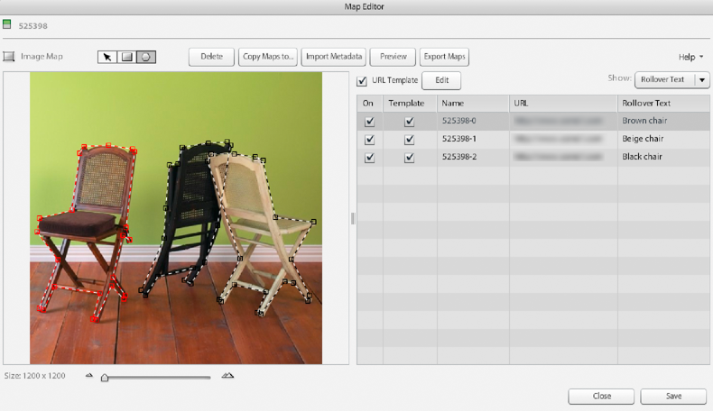

# Create Image Maps {#creating-image-maps}

An Image Map is a region on an image, an eCatalog page, or an image in a SpinSet, that displays a rollover panel with text. When the user selects an Image Map, an action of some kind is triggered. For example, a web page is launched so that the user can learn more about a product. An outline appears around an Image Map when the user moves the pointer over it.

Besides the ability to create image maps in Adobe Dynamic Media Classic, you can also create image maps when you design a catalog in Adobe Acrobat or Adobe InDesign.

When you create Image Maps, you can do any of the following:

* Enter rollover text.
* Enter JavaScript and URLs for launching web pages.
* Create URL templates for Image Maps.
* Copy Image Maps to other images, or eCatalog pages, or SpinSets.
* Export Image Maps to CSV or to XML.
* Import image metadata from a tab-delimited file or from an XML file.
* Define other actions as determined by the World Wide Web Consortium.
* Preview Image Maps.

## Draw and adjust an Image Map {#drawing-and-adjusting-an-image-map}

1. Do one of the following:

    * If you are working with an image in the Grid View or List View, in the Edit drop-down list select **[!UICONTROL Image Map]**. Or, open it in Detail View, and then select **[!UICONTROL Image Map]** above the image.
    * If you are working with a SpinSet in the Grid View or List View, select **[!UICONTROL Edit]**. Or, open it in Detail View, and then select **[!UICONTROL Edit]**. Select an image asset, and then select **[!UICONTROL Image Map]**.
    * If you are working with an eCatalog, in the Grid View, List View, Detail View, select **[!UICONTROL Edit]**. Select the **[!UICONTROL Map Pages]** tab.

   

1. Draw a rectangular or polygonal (many-sided) Image Map:

   * **Rectangular map** - Select the Rectangle Image Map tool and drag on the page to create the rectangle. To add a point to a rectangular map (thus changing it to a polygon map), press Ctrl, then place the insertion tool at the desired location and select.

   * **Polygonal map** - Select the Polygon Image Map tool and select points on the perimeter of the area of the image you want to enclose. Use the polygon density slider to vary the point density in the polygon. The original density is remembered if you select other maps. If any point is added, deleted, or moved in the polygon, the original density is lost and the slider is reset to its maximum value.

1. Enter a name for the Image Map, if desired, in the Image Map list. After you draw an Image Map, Adobe Dynamic Media Classic assigns it a name.

   To create the name, Adobe Dynamic Media Classic appends a sequential number to the name of the image or eCatalog page you are working with. You can enter a name of your choice.

1. If you want users to open a new web page when they select the Image Map, enter the URL in the Image Map list.

   See [to enter JavaScript and URLs](creating-image-maps.md#using_a_template_to_enter_javascript_and_urls).

1. To display rollover text when users move the pointer over your Image Map, enter the text in the Image Map list. In the Image Map list, select the **[!UICONTROL Show]** menu and select **[!UICONTROL Rollover Text]**. Then enter the text you want users to see onscreen. You can write the text in a word processor and copy it into the Rollover text field.

1. If you want another action effect to occur when users move the mouse over an Image Map, define the action. In the **[!UICONTROL Show]** drop-down list, select **[!UICONTROL Other Actions]**. Enter the attributes of the action. (Go to **[!UICONTROL Show]** > **[!UICONTROL Both]** to create rollover text and an action for an Image Map.)

   See [Define other actions for Image Maps](creating-image-maps.md#defining_other_actions_for_image_maps).

1. (Optional) Do any of the following:

    * To preview Image Maps, select **[!UICONTROL Preview]**.
    * To delete an Image Map or polygon vertex, select a shape on the image, and then select **[!UICONTROL Delete]**. Or, for an eCatalog, on the Order Pages tab, select **[!UICONTROL Clear Maps]** to remove Image Maps from all pages.
    * To temporarily remove an Image Map from an image, an image in a SpinSet, or an eCatalog page, without deleting it, deselect the appropriate On option in the Image Map list.

1. Select **[!UICONTROL Save]**.

### Adjust the position, shape, and size of Image Maps {#adjusting-the-position-shape-and-size-of-image-maps}

To change the position, shape, and size of an Image Map, select the Image Map button. Then, select the **[!UICONTROL Pan]** tool and follow these instructions:

* **Change position** - Move the pointer near to but not over the border of the Image Map. When you see the four-headed arrow icon, drag the map to a new location.

* **Change the size and shape** - How you change the shape and size of an Image Map depends on whether you are working with a rectangular or polygonal Image Map:

>[!TIP]
>
>You can drag the Size slider at the bottom of the screen to change views and get a better look at your Image Map.

* **Rectangular Image Map** - Move the pointer over a side or corner of the Image Map. When you see the double-headed arrow icon, start dragging. Hold down the Shift key as you drag to change size but maintain the aspect ratio (the shape).

* **Polygonal Image Map** - Drag a square selection handle. To create a selection handle, select the border of the Image Map and start dragging.

### Handle overlapping Image Maps {#handling-overlapping-image-maps}

If your image or eCatalog page includes more than one Image Map and the maps overlap, you can determine how maps overlap. To do so, change the order of maps on the Image Map list. Drag their names higher or lower on the list. How high a name is on the list determines whether its Image Map overlaps other Image Maps.

### Import Image Map data {#importing-image-map-data}

Rather than enter Image Map data on each page, you can import the data for your image, Spin Set, or eCatalog into the Map Summary screen. You import the Image Map data in the form of a tab-delimited file or XML DTD. The fields in your file must be in the order shown in the Map Summary screen: Name, TOC Labels, Maps, URLs, Rollover Text, Other Actions, and Search Strings. Importing Image Map data saves you the trouble of entering the data in the Image Map List as you create each Image Map.

**To import Image Map data:**

1. Go to the Image Map editor page (for images or images in SpinSets) or the Map Pages tab of the eCatalog editing screen.
1. Select **[!UICONTROL Import Metadata]**.
1. In the Upload Metadata dialog box, select Image or Image Map to upload the metadata from desired asset property type.
1. In the Generate File drop-down list, select the type of file that you want to create.
1. (Optional) Select **[!UICONTROL Generate]** to preview the resulting data based on the type of file you want to create. Select **[!UICONTROL Close]** to return to the Upload Metadata dialog box.
1. Browse to the file that you want to upload. In the File Name text field, specify the name of the generated file.
1. (Optional) In the Job Name field, specify a name for the metadata upload job.
1. Select **[!UICONTROL Upload]**.

### Copy Image Maps {#copying-image-maps}

You can copy Image Maps from an image or an eCatalog page to another. Use **[!UICONTROL Copy Image Map]** to get a head start creating them. You can also copy Image Maps to re-create them in images or pages that share layout or mapping structure.

For example, copying Image Maps in an eCatalog is a convenient way to copy all image maps between foreign language versions of the same eCatalog. For best results, copying is most successful if you copy between eCatalogs with the same number of pages and same images. If the eCatalog to which you copy already contains Image Maps, those Image Maps are deleted when the copy is made.

**To copy Image Maps:**

1. Go to the Image Map editor page (for images or images in SpinSets) or the Map Pages tab of the eCatalog editing screen.
1. Select **[!UICONTROL Copy Maps to]**.
1. Do one of the following, based on if you are copying Image Maps from images or copying Image Maps from an eCatalog:

    * (Images) In the Select Images screen, select the images that you want to copy the Image Maps to.
    * (eCatalog) In the Select Asset screen, select the images or eCatalog pages that you want to copy the Image Maps to.

1. Choose **[!UICONTROL Select]**.

## Use a template to enter JavaScript and URLs {#using-a-template-to-enter-javascript-and-urls}

You can define a URL template (also known as an Href template) to make entering Image Map URLs easier and more efficient. Define a URL template if most of your Image Map URLs share a common, fixed format. By entering the portion of the URL that is fixed as the URL template, you do not have to enter this portion of the URL each time you create an Image Map. Your URL Template can also contain JavaScript commands, pathnames, and parameters. By default, the URL template contains a proprietary Adobe Dynamic Media Classic JavaScript handler called `loadProduct` that opens the image in a new window.

>[!NOTE]
>
>When you add the JavaScript code into the HREF attribute of your image map, the code is run on the client's computer. Therefore, make sure that the JavaScript code is secure.

### About URL templates {#about-url-templates}

The URL template works by substituting the contents of the URL column in the Image Map list with the double dollar signs (‘$$’) in the template:

```as3
Javascript:loadProduct(‘$$’);void(0);
```

You place all values that do not change between Image Maps in the URL template. Add only the values that do change in the URL column in the Image Map list. For example:

* URL template - `javascript:loadProduct(‘https://www.examplesitehere.com/$$’);void(0);`
* URL value - `product.htm`
* Actual URL generated - `javascript:loadProduct(‘https://www.examplesitehere.com/product.html);void(0);`

By default, the URL template includes a proprietary Adobe Dynamic Media Classic JavaScript handler called `loadProduct` that opens a new window with the URL destination. However, you can use any JavaScript code to replace this JavaScript handler or use one of the following Adobe Dynamic Media Classic handlers:

* `loadProductCW` - Displays the URL target specified in the URL column in the current window. This handler is primarily for eCatalogs that are integrated into a page within a website.

* `loadProductPW` - Displays the URL target specified in the URL column in the parent window (the page that opened the current one). The current window remains open, but the parent window changes to display the URL target.

  >[!NOTE]
  >
  >The handler `loadProductPW` does not support DHTML and HTML5 viewers.

### Create a URL template {#creating-a-url-template}

1. On the Map Editor screen (images or SpinSets) or the Map Pages tab of the eCatalog screen (eCatalogs), select Edit next to the URL Template option. The Edit Map Template dialog box opens.
1. Enter the JavaScript code and the complete URL (with the variable portion replaced by dollar signs [$$]). You can paste the code by right-clicking and choosing **[!UICONTROL Paste]**.
1. Select **[!UICONTROL Save]**.

### Handle URL templates {#handling-url-templates}

The Map Editor page (images and SpinSets) and the Map Pages tab of the eCatalog screen (eCatalogs) offer these commands for handling URL templates:

* **URL Template option** - Select the URL Template option to apply your URL template to all the Image Maps on an image or eCatalog page.

* **Template option** - Deselect a Template option in the URL Image Map list if you do not want an individual Image Map to use the URL template.

## Define other actions for Image Maps {#defining-other-actions-for-image-maps}

You can select the **[!UICONTROL Show]** menu and choose **[!UICONTROL Other Actions]** to trigger actions other than rollover text and web page launches. When the user moves the pointer over an Image Map, you can initiate an action. These actions are attributes defined for client-side Image Maps by World Wide Web Consortium HTML specifications. They include:

* **`accesskey`** - Triggers an action when the user presses a designated key on the keyboard.

* **`onfocus`** - Triggers an event when the Image Map receives focus—by the cursor, by tabbing, or by pressing an access key. For example, you can launch a web page when the Image Map receives focus and close it when your Image Map loses focus.

* **`onblur`** - Triggers an event when the Image Map loses focus, either by the cursor or by tabbing.

**To define other actions for Image Maps:**

1. On the Map Editor screen (images and SpinSets) or Map Pages tab of the eCatalog screen (eCatalogs), select the **[!UICONTROL Show]** menu and select **[!UICONTROL Other Actions]**.
1. Using the syntax specified by the World Wide Web Consortium HTML specifications, add the supported attributes in the Other Actions column of the Image Map list.
1. Select **[!UICONTROL Save]**.

Select the **[!UICONTROL Show]** menu and select **[!UICONTROL Both]** if you want an Image Map to have rollover text and an action.

## Create Image Maps in Adobe Acrobat or Adobe InDesign {#creating-image-maps-in-adobe-acrobat-or-adobe-indesign}

You can create Image Maps while designing your eCatalog in Adobe Acrobat or Adobe InDesign.

In Acrobat or InDesign, create hyperlink references where you want the Image Maps to appear, and specify URL locations for the image map. Selecting the Extract Links option when uploading the PDF file into Adobe Dynamic Media Classic automatically converts the links to Image Maps.

For more information, see Adobe InDesign Help or Adobe Acrobat Help.

### To create Image Maps in Adobe InDesign {#to-create-image-maps-in-adobe-indesign}

1. In InDesign, go to **[!UICONTROL Windows®]** > **[!UICONTROL Interactive]** > **[!UICONTROL Hyperlinks]**.
1. In the Hyperlinks panel, select the text, frame, or graphic that you want to make into an Image Map.
1. Select **[!UICONTROL New Hyperlink]** from the panel menu. 
1. In the New Hyperlink dialog box, from the **[!UICONTROL Link To]** menu, choose **[!UICONTROL URL]**.
1. Type or paste the product ID in the URL box.
1. Select **[!UICONTROL OK]**. (Adobe Dynamic Media Classic completes the URL using the Image Map URL template.)

   >[!NOTE]
   >
   >You do not need to set appearance options in Adobe InDesign. You can specify appearance in Adobe Dynamic Media Classic.

1. Repeat steps 2 through 6 for all the Image Maps you want to create.
1. Export the file as a PDF.
1. Upload the PDF to Adobe Dynamic Media Classic.
1. In **[!UICONTROL PDF Options]**, select **[!UICONTROL Extract Links]**.

### To create Image Maps in Adobe Acrobat {#to-create-image-maps-in-adobe-acrobat}

1. In Acrobat, go to **[!UICONTROL Tools]** > **[!UICONTROL Advanced Editing]** > **[!UICONTROL Link Tool]**.
1. Drag to create the Image Map.
1. In the Create Link box, select **[!UICONTROL Custom Link]**, and select **[!UICONTROL Next]**.

>[!NOTE]
>
>You do not need to set appearance options in Adobe Acrobat. You can specify appearance in Adobe Dynamic Media Classic.

1. In the Link Properties box, select **[!UICONTROL Actions]**.
1. Select **[!UICONTROL Open A Web Link]** from the Select Action menu, and then select **[!UICONTROL Add]**.
1. Type the product ID for the Image Map in the Edit URL box, and select **[!UICONTROL OK]**. (Adobe Dynamic Media Classic completes the URL using the image map URL template.)
1. Repeat steps 1 through 7 for all the Image Maps you want to create.
1. Save the file.
1. Upload the PDF to Adobe Dynamic Media Classic and select Extract Links from the PDF Options.
