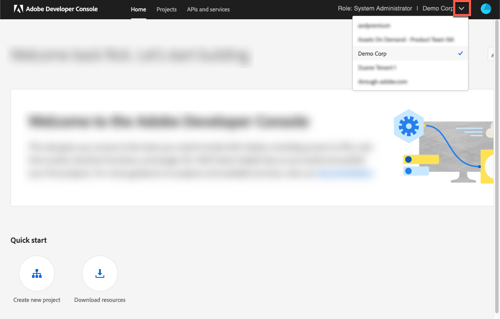
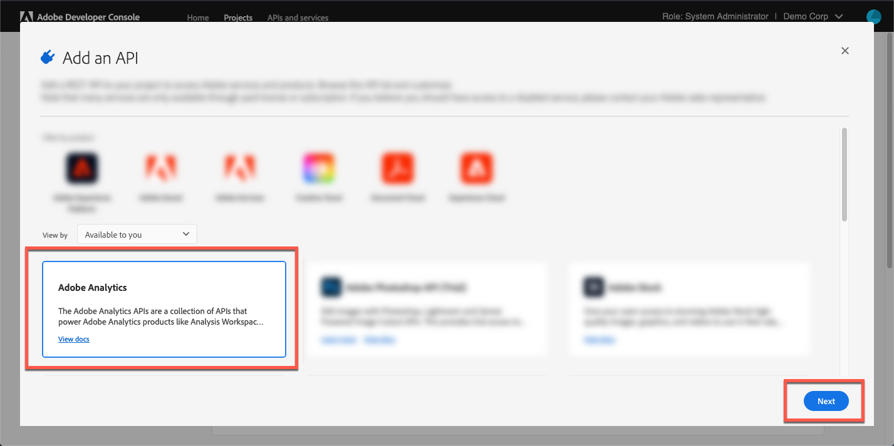

# Log in to Adobe Analytics{#log-in-to-adobe-analytics}

Before you log in to configure Adobe Analytics reports and match Adobe Analytics report variables to Adobe Dynamic Media Classic events, verify that you are a member of the Web Service Access group in Adobe Analytics. Members in this group can access all reports in the specified report suites by way of the Experience Cloud’s Web Services API regardless of the permissions set in the interface. To add a member to the group, in Adobe Analytics, go to **[!UICONTROL Admin Tools]** > **[!UICONTROL User Management]** > **[!UICONTROL Edit Groups]**.

When you log in, you have the option of entering your Experience Cloud Org ID to use the latest video analytics implementation. If you choose not to enter your ID, video reporting still works. However, it can cause the data to not integrate correctly with other data for that client from outside Adobe Dynamic Media Classic.

>[!NOTE]
>
>If your Adobe Analytics account has been migrated to Adobe IMS-based authentication (Identity Management System) for login, entering direct credentials does not work.

**To log in to Adobe Analytics from Adobe Dynamic Media Classic:**

Begin by integrating Dynamic Media Classic with Adobe Analytics OAuth. The Adobe Analytics OAuth integration with Dynamic Media Classic is typically only done once per user.

1. Access [Adobe Developer Console](https://developer.adobe.com/console). Ensure that your account has administrator permissions for the organization for which the integration is required.
1. Near the upper-right corner of the Home page, from the drop-down list, select the appropriate company. (The screenshot below is for information purposes only; the actual company name you select can vary.)

   

1. Do either one of the following:

   * At the top of the page, from the **[!UICONTROL Home]** tab, select **[!UICONTROL Create new project]**.
   * At the top of the page, from the **[!UICONTROL Projects]** tab. Near the right-corner of the page, select **[!UICONTROL Create new project]**.

1. On the project's page, select **[!UICONTROL Add API]**.
1. On the **[!UICONTROL Add an API]** page, select **[!UICONTROL Adobe Analytics]**.
1. Near the lower-right corner of the page, select **[!UICONTROL Next]**.

   

1. On the **[!UICONTROL Configure API]** page, select **[!UICONTROL USER AUTHENTICATION OAuth]**.
1. Near the lower-right corner of the page, select **[!UICONTROL Next]**.
1. On the **[!UICONTROL Configure API]** page, select **[!UICONTROL OAUTH 2.0 Web]**.
1. In the **[!UICONTROL Default redirect URI]** text field, enter the following path exactly as shown:

   `https://exploreadobe.com/dynamic-media-upgrade/`

1. In the **[!UICONTROL Redirect URI pattern]** text field, enter the following path exactly as shown:

   `https://exploreadobe\.com/dynamic-media-upgrade/`

1. In the lower-right corner of the page, select **[!UICONTROL Save configured API]**.
1. In the navigation panel, on the left side of the Adobe Analytics page, under **[!UICONTROL Credentials]**, select **[!UICONTROL OAuth Web]**.
1. Under **[!UICONTROL Credential details]**, do the following:
   * Under **[!UICONTROL Client ID]**, select **[!UICONTROL Copy]** to copy the value. You need this value for the subsequent Analytics configuration in the Dynamic Media Classic desktop application that is to follow.
   * Under **[!UICONTROL Client Secret]**, select **[!UICONTROL Retrieve client secret]** to reveal the associated value. Select **[!UICONTROL Copy]** to copy the value. You need this value for the subsequent Adobe Analytics configuration in Dynamic Media Classic desktop application that is to follow.

**Configure Adobe Analytics in Dynamic Media Classic desktop application**

>[!NOTE]
>
>After your initial configuration of Adobe Analytics in Dynamic Media Classic, the only times you must redo the configuration is in the following cases:
>
>* A new report is added in Analytics and user wants to start sending data to that new report.
>* The Tracking server is updated in Adobe Analytics.
>* A new tracking variable is introduced in a report and you want to link a specific Viewer variable in the Dynamic Media Classic user interface to that new Analytics variable.
>

1. Near the upper-right corner of the Adobe Dynamic Media Classic desktop application, go to **[!UICONTROL Setup]** > **[!UICONTROL Application Setup]**.
1. In the left panel, under **[!UICONTROL Application Setup]**, select **[!UICONTROL Adobe Analytics]**.
1. On the **[!UICONTROL Adobe Analytics Configuration]** page, select **[!UICONTROL Adobe Analytics Login]**.
1. In the **[!UICONTROL Adobe Analytics Login]** dialog box, in the Client ID field and the Client Secret field, paste the respective values that you copied earlier.
1. Perform IMS login.

   When you are successfully logged in, the **[!UICONTROL COMPANIES]** drop-down list, initiated by the companies that are available to you, becomes visible.

1. From the **[!UICONTROL COMPANIES]** drop-down list, choose a company.

   After you select a company, the **[!UICONTROL SUITES]** drop-down list, initiated by the Report Suites that are available for the selected company, becomes visible.

1. From the **[!UICONTROL SUITES]** drop-down list, choose a report suite.

   >[!NOTE]
   >
   >By default, the user must be aware of the fact that both **[!UICONTROL COMPANIES]** and **[!UICONTROL SUITES]** drop-down lists are empty. As such, the user must select a value from each list. -->

1. Select **[!UICONTROL OK]** so you can save configuration.

>[!MORELIKETHIS]
>
>* [Configure Adobe Analytics reports](configuring-analytics-reports.md#configuring_adobe_analytics_reports)
