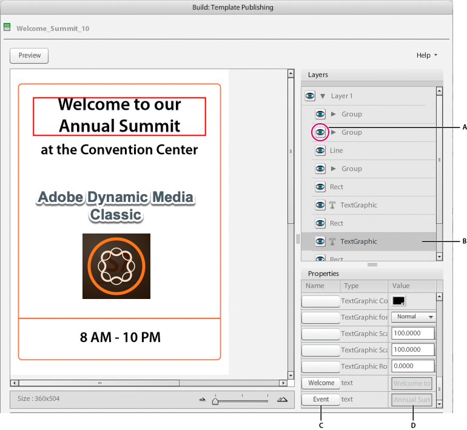

# Parameterizing a template in Scene7{#parameterizing-a-template-in-scene}

After you upload an Illustrator template that you saved as Scene7 FXG to the Scene7 Publishing System, you can define its variable elements. Do so by parameterizing variable elements in the Template Publishing Build and Preview screens. Scene7 offers tools for defining text and object parameters on layers and their respective properties. You can also create different versions of a template.

Parameterizing an FXG template allows you to customize the variability of text, images, and graphics in the template. For example, you can parameterize a line of text so that end users can modify the text through a web user interface. You can define empty text fields as variable so that end users can fill these fields with personalized text. You can also parameterize the attributes and properties of design elements in the S7 Template Publishing Build screen.

>[!NOTE]
>
>Parameterizing the template in Scene7 is not required if you plan to use DOM manipulation.

## Defining parameters in FXG templates {#defining-parameters-in-fxg-templates}

Follow these steps in Scene7 to define parameters for an FXG template:

1. In the Browse window, select the FXG file.
1. Click Build and choose Template Publishing, or click the file’s Edit button.

   The Template Publishing screen opens.

1. Select LRCo\FXG\Welcome_Summit_10 (FXG file) and choose Build &gt; Template Publishing.

   

1. In the Layers panel in the Template Publishing screen, select the layer with the elements that you want to parameterize.

   >[!NOTE]
   >
   >Click the eye icon on and off to make sure that you select the object you want.

1. In the Properties panel, click a parameter in the Name column (to parameterize text) or Parameter column (to parameterize objects).

   **Text** Click in the text field (scroll to the bottom of the Properties list to find it). The Parameters dialog box appears. Select the text that you want to parameterize and click Add. You can create multiple parameters from the same text property by selecting different portions of the text and adding parameters for each portion. To change the name of the parameter, click it, enter a new name, and click Close.

   **Objects** Click a box in the Parameter column. The Edit Parameter dialog box appears. Enter a name and click OK.

   To customize multiple attributes at once with the same value, use the same parameter name for each attribute. For example, if your template has a rectangle and a star, you can type `newcolor` as the Parameter name for the SolidColor color attribute of each. Whenever you change the `newcolor` value, both the rectangle and the star change to the new color.

1. Specify a default value for the attribute in the Value or Data field. Set all properties for the selected object to specify the exact appearance you want.
1. (Optional) Repeat steps 3- 5 for all objects or layers that you want to parameterize. 
1. Click Save or Save As.
1. Click Preview to open the FXG Preview window and see the parameters you created with their default values.

## Show or hide an object or layer in the FXG template {#show-or-hide-an-object-or-layer-in-the-fxg-template}

Hidden objects and layers are not visible in preview or output, but are not deleted from the file. You can make them visible again as desired. Visibility is an attribute that you can make variable. Clicking the eye icon on or off sets the default value for the visibility of an object or layer.

1. In the Objects panel, click the eye icon next to an object or layer name to hide it in the file. 
1. Click again to make the object visible.

## Create different versions of a template {#create-different-versions-of-a-template}

You can edit attributes to create different versions of the template for different uses.

In the Template Publishing screen, click Save As to save the file as a new FXG template without overwriting the original FXG template.

## Using stroked text {#using-stroked-text}

Stroked text is an example of how you can parameterize attributes. Scene7 supports these stroked text features:

* Width of stroke
* Dashed stroke pattern
* Different join styles
* Different cap end styles
* Overprinting of stroke
* Separate color handling for stroke, including spot color support

This table describes the attributes that support stroked text.

|Attribute|Description|
|--- |--- |
|s7:fill `<Boolean> `(S7FXG Only)|Specifies whether fill is enabled for text. Default is true.|
|s7:stroke `<Boolean>` (S7FXG Only)|Specifies whether stroke is enabled for text. Default is false.|
|s7:weight `<number>` (S7FXG Only)|Specifies the weight of the stroke for text in points. Default is 1 point.|
|s7:joints `<string>` (miter, round, bevel) (S7FXG Only)|Specifies the type of join of the stroke. Default is round.|
|s7:caps `<string>` (none, round, square) (S7FXG Only)|Specifies the type of cap of the stroke. Default is round.|
|s7:miterLimit `<number>` (S7FXG Only)|Specifies the limit of the miter when join is miter join for the stroke. Default is 4.|
|s7:strokeOverprint `<Boolean>` (S7FXG Only)|Specifies whether the overprint is enabled for stroke. Default is false.|
|s7:strokeColorName (S7FXG Only)|Same as s7:colorName, except it defines the name of the color for the stroke.|
|s7:strokeColorValue (S7FXG Only)|Same as s7:colorValue, except it defines the value of the color being used for the stroke.|
|s7:strokeColorspace (S7FXG Only)|Same as s7:colorspace, except it defines the colorspace of the stroke.|
|flm:dashPattern `<array>` (S7FXG Only)|By default there are no patterns for the dashes and gaps. This attribute defines the dash/gap pattern of the stroke. The first value is the dash of the stroke. The second is the gap in between the dashes. You can extend the array for multiple values in the same manner with alternate values being specified as dash and gap.|

## Using warped text {#using-warped-text}

Warped text enables you to modify the appearance of text with effects like wave, flag, stretch, and so on.

Warped text is supported for RichText objects. Text can be vertical or horizontal, and can be point text, area text, and type-on-a-path text. The entire text object must be selected before warped text can be applied.

Warped text can be created in Adobe Illustrator.

When warping text, you can set the following attributes:

* Style
* Direction
* Bend
* Horizontal distortion
* Verticle distortion

Each attribute contains a set of values.

|Attribute|Values|Default|
|--- |--- |--- |
|Styles7:warpStyle|nonearcarcLowerarcUpperarchbulgeshellLowershellUpperflagwavefishrisefishEyeinflatesqueezetwist|none|
|Directions7:warpDirection|horizontalvertical|horizontal|
|Bends7:warpBend|-1 to 1|0.5|
|Horizontal Distortions7:warpHorizontalDistortion|-1 to 1|0|
|Verticle Distortions7:warpVerticalDistortion|-1 to 1|0|

>[!NOTE]
>
>For `inflate` and `fishEye`, changing the `s7:warpDirection` flag between horizontal and vertical does not have any effect on the output.

For more information about creating and using warped text, see the Adobe Illustrator documentation.

>[!MORE_LIKE_THIS]
>
>* [Create the initial template in Illustrator](create-initial-template-illustrator.md#create_the_initial_template_in_illustrator)
>* [Upload files for Template Publishing](upload-files-template-publishing.md#upload_files_for_template-publishing)
